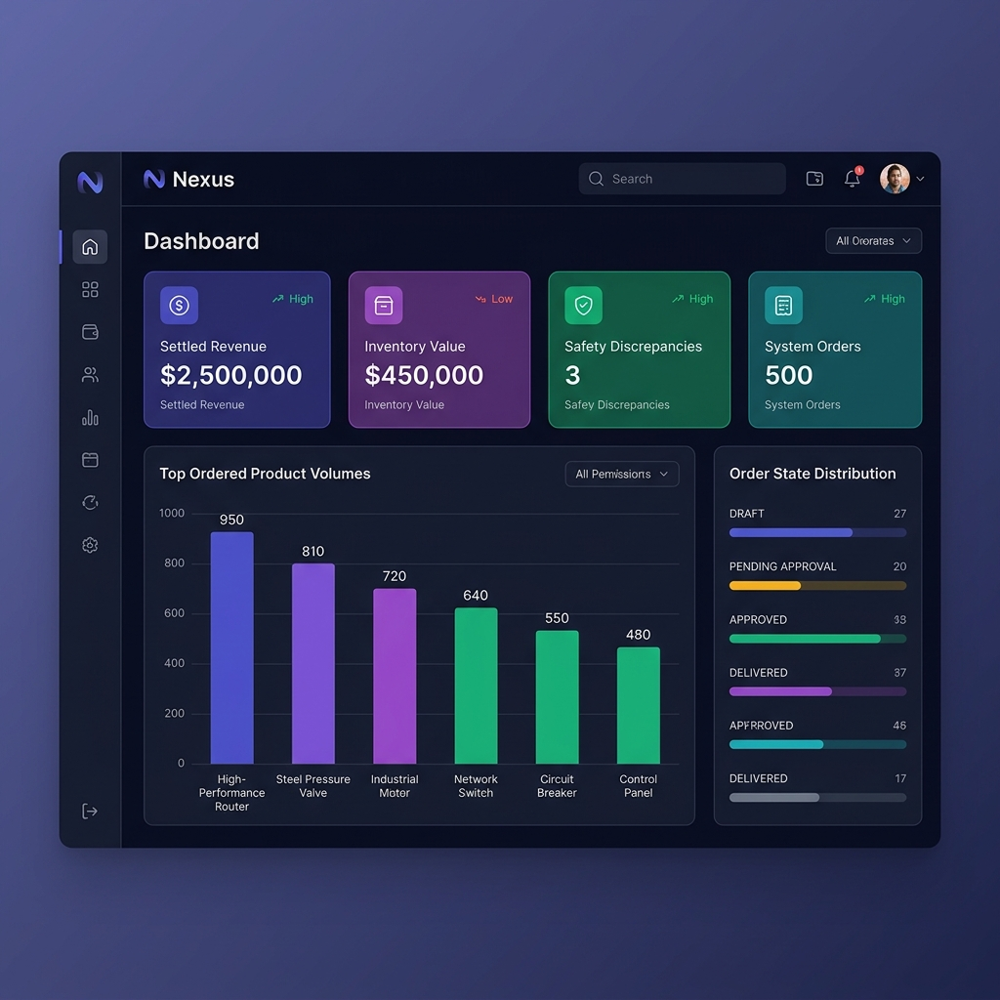
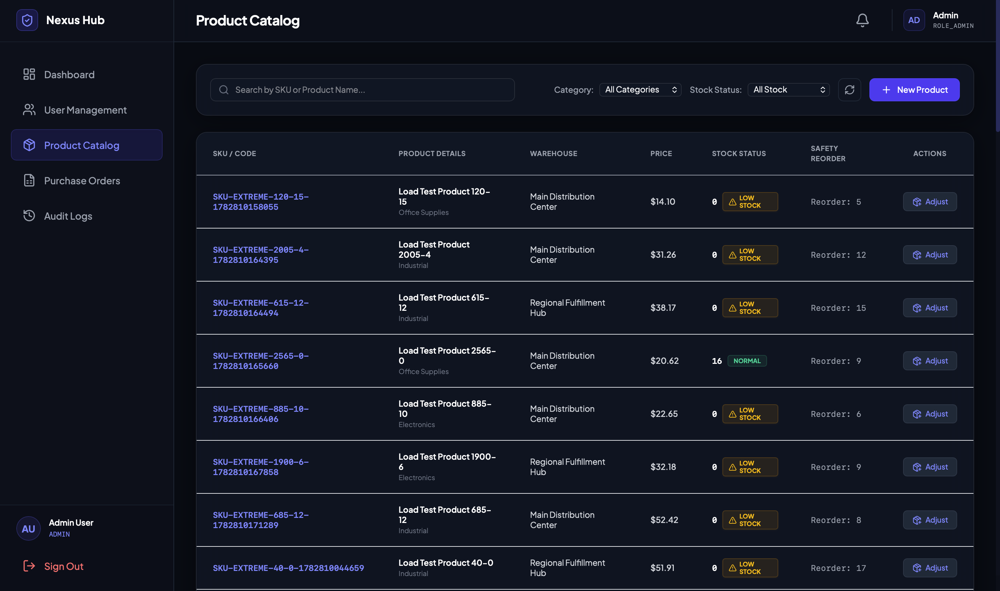
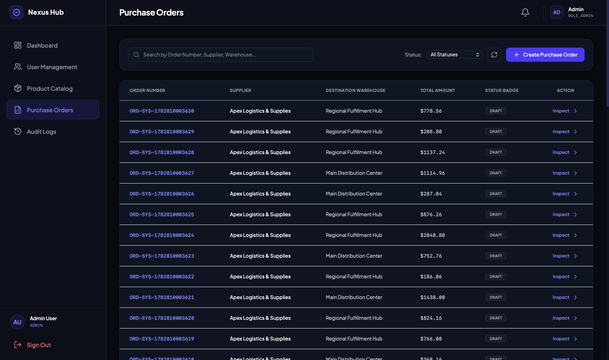
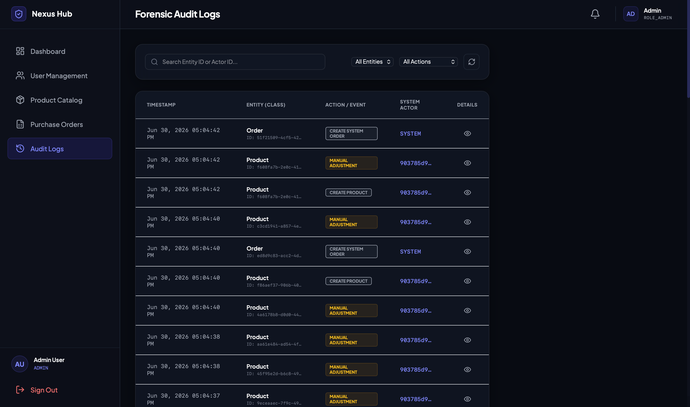
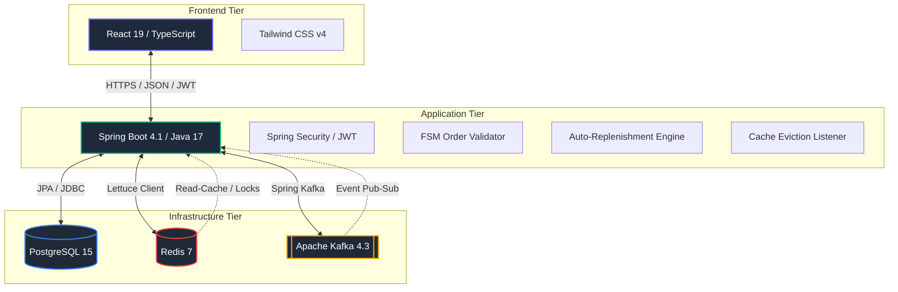
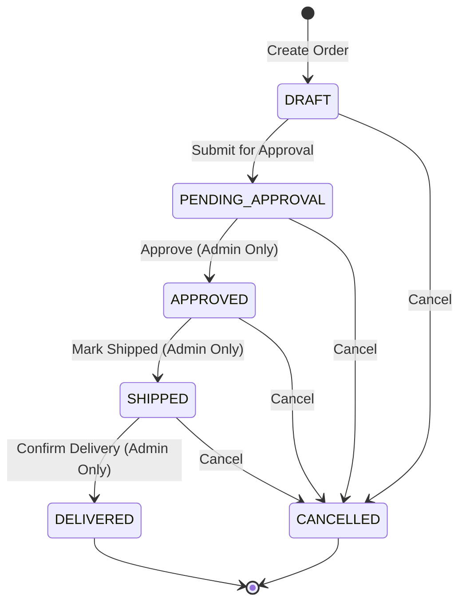
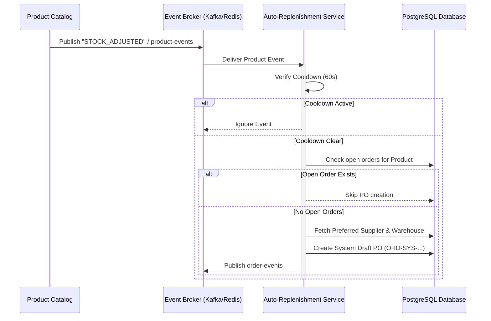

# Nexus Supply Chain

A full-stack supply chain management platform built with a Spring Boot backend, React frontend, and a supporting infrastructure of PostgreSQL, Redis, and Kafka.

---

## Key Features

- **Role-Based Access Control (RBAC)**: Secure access using JWT for two roles:
  - `ROLE_ADMIN`: Full system access, including the Operations Dashboard, Forensic Audit Logs, and User Management (provisioning/managing staff & administrator accounts).
  - `ROLE_STAFF`: Read/write access to the Product Catalog and Purchase Orders, with restrictions preventing them from advancing orders beyond `DRAFT`/`PENDING_APPROVAL`.
- **User Management & Provisioning**: Secure administrator-only console to view the system user directory, search and filter users by name, email, or role, and register new administrative (`ROLE_ADMIN`) or staff (`ROLE_STAFF`) credentials. Features client-side/server-side validation and secure password hashing.
- **Product Catalog Management**: Track SKUs, inventory stock levels, unit prices, reorder thresholds, and active status. Products are assigned to specific Warehouses and Suppliers.
- **Purchase Order Management**: Full lifecycle management of purchase orders with an enforce-valid transition Finite State Machine (FSM).
- **Auto-Replenishment Engine**: Event-driven automation that monitors stock levels. When inventory falls below the reorder threshold, it automatically creates a system draft order. Features:
  - *Rate-Limiting Cooldown*: 60-second per-product window prevents duplicate orders under heavy load.
  - *Open Order Detection*: Automatically skips order generation if there are already active open orders.
- **Debounced Cache Eviction**: Integrated Redis caching for high-read entities (Products, Categories, Warehouses). Eviction is triggered asynchronously via pub-sub events and debounced to prevent cache stampedes.
- **Forensic Audit Logs**: Immutably record all critical actions (Order Creation, Order Status Updates, Stock adjustments) with before/after state snapshots.

---

## UI Screenshots

<table width="100%">
  <tr>
    <td width="50%">
      <p align="center"><b>Operations Dashboard</b></p>
      
    </td>
    <td width="50%">
      <p align="center"><b>Product Catalog & Stock Adjustment</b></p>
      
    </td>
  </tr>
  <tr>
    <td width="50%">
      <p align="center"><b>Purchase Orders FSM Manager</b></p>
      
    </td>
    <td width="50%">
      <p align="center"><b>Forensic Audit Logs Ledger</b></p>
      
    </td>
  </tr>
</table>

---

## Tech Stack

| Layer / Category | Technologies & Tools Used |
|---|---|
| **Frontend Core** | React, TypeScript, Vite, Tailwind CSS, React Router, Axios, Lucide React |
| **Frontend Web Server** | Nginx |
| **Backend Core** | Spring Boot, Java, Spring Security (JWT authentication), Spring Data JPA |
| **Database Migrations** | Liquibase |
| **Database & Pooling** | PostgreSQL, Hibernate, HikariCP connection pool |
| **Caching & Locking** | Redis, Spring Cache |
| **Messaging & Events** | Apache Kafka, Spring Kafka |
| **DevOps & IaC** | Terraform, Docker |
| **CI/CD Pipeline** | GitHub Actions |
| **Staging/Prod Cloud** | Azure Web Apps (Consolidated), Azure Database for PostgreSQL Flexible Server, Azure Managed Redis (Balanced_B0) |
| **Monitoring & Metrics** | Prometheus, Grafana, Node Exporter, Spring Boot Actuator, Micrometer |
| **Testing - Unit/API** | JUnit 5, Mockito, REST Assured, Spring MockMVC |
| **Testing - Integration**| Testcontainers |
| **Testing - Load/Stress**| k6, Python |
| **Quality & Coverage** | JaCoCo Maven Plugin (coverage report) |

### System Architecture



### Kafka & Redis Integration: Why Both?

Nexus utilizes both layers to solve distinct performance and architectural challenges:

* **Apache Kafka (Messaging Queue / Event Log)**:
  * Used as a **durable, persistent event broker** for decoupled asynchronous messaging.
  * Handles domain events (such as `STOCK_ADJUSTED`, `ORDER_CREATED`, `ORDER_DELIVERED`) reliably, ensuring that key business reactions (like auto-replenishment order generation or notifications) occur eventually and out-of-band from the main request thread, keeping user-facing actions ultra-fast.
* **Redis (Caching & Locking)**:
  * Used as an **in-memory database** for high-performance reading and transient coordination.
  * Caches high-read entity objects (Products, Warehouses, Categories) to bypass PostgreSQL database roundtrips, returning catalog details in sub-millisecond times.
  * Facilitates short-lived state locks (like the 60-second replenishment cooldown window) and lightweight pub-sub for cache eviction debouncing.

---

## Core Workflows

### 1. Purchase Order Lifecycle (FSM)
All purchase orders follow a strict, validated state transition flow:



- **Stock Increment**: When an order transitions to `DELIVERED`, the system automatically increments the stock levels of the ordered products in the database.
- **Permissions**: Only `ROLE_ADMIN` can transition orders into `APPROVED`, `SHIPPED`, or `DELIVERED` states.

### 2. Auto-Replenishment Workflow
The auto-replenishment process runs asynchronously based on stock levels:



### 3. Event-Driven Cache Eviction
High-read data caches are invalidated automatically using pub-sub topics:

1. **Mutation**: A product, category, or warehouse is updated or an order is delivered.
2. **Event Broadcast**: The backend publishes a domain event to the corresponding topic (`product-events`, `order-events`, etc.).
3. **Debounced Eviction**: `CacheEvictionListener` intercepts the event and schedules cache invalidation with a 1-second debounce window to prevent database query spikes during high concurrent writes.

---

## Prerequisites

Make sure the following are installed on your machine before getting started:

- [Docker Desktop](https://www.docker.com/products/docker-desktop/) (includes Docker Compose)
- [Java 17+](https://adoptium.net/) — for running the backend locally
- [Maven 3.9+](https://maven.apache.org/download.cgi) — or use the included `./mvnw` wrapper
- [Node.js 20+](https://nodejs.org/) & npm — for running the frontend locally
- [k6](https://k6.io/docs/get-started/installation/) *(optional)* — for running load tests locally

---

## Running with Docker (Recommended)

The easiest way to run the entire stack is with Docker Compose. This starts all services — database, cache, Kafka, backend, and frontend — in one command.

### 1. Clone the repository

```bash
git clone https://github.com/your-org/nexus-supply-chain.git
cd nexus-supply-chain
```

### 2. Start all services

```bash
docker compose up --build
```

> The first run will take a few minutes as Docker builds the backend and frontend images and pulls the base images.

### 3. Access the application

| Service | URL |
|---|---|
| **Consolidated Web App** | `http://localhost` (or `http://localhost:8080`) |
| **PostgreSQL** | `localhost:5433` (DB: `supply_db`) |
| **Redis** | `localhost:6379` |
| **Kafka** | `localhost:9092` |

### 4. Stop the stack

```bash
docker compose down
```

To also remove persistent volumes (database data):

```bash
docker compose down -v
```

---

## Running Locally (Without Docker)

For active development, you can run the backend and frontend locally while keeping infrastructure services (PostgreSQL, Redis, Kafka) in Docker.

### Step 1 — Start infrastructure services

Use the dedicated dev Compose file from the `docker/` directory:

```bash
docker compose -f docker/dev.docker-compose.yml up -d
```

This starts PostgreSQL on port `5432` and Redis on port `6379`.

> **Kafka:** The dev Compose file only starts Postgres and Redis. If your feature requires Kafka, start the full stack with `docker compose up -d db redis kafka` from the project root instead.

### Step 2 — Run the Backend

Navigate to the `backend/` directory and start the Spring Boot application:

```bash
cd backend

# Using the Maven wrapper (no Maven installation needed)
./mvnw spring-boot:run

# Or if you have Maven installed
mvn spring-boot:run
```

The backend reads from `application.properties` and defaults to local service addresses, so no additional environment variables are needed when running locally.

The API will be available at **http://localhost:8080**.

### Step 3 — Run the Frontend

In a separate terminal, navigate to the `frontend/` directory:

```bash
cd frontend

# Install dependencies (first time only)
npm install

# Start the dev server
npm run dev
```

The frontend will be available at **http://localhost:5173** (Vite default).

> In dev mode, the frontend talks directly to `http://localhost:8080`. In production (Docker), it goes through the nginx reverse proxy.

---

## Environment & Configuration

The backend is configured via [backend/src/main/resources/application.properties](file:///Users/janlancelot/Desktop/Projects/nexus-supply-chain/backend/src/main/resources/application.properties). All sensitive values use environment variable overrides with sensible local defaults.

| Property | Env Variable | Default (Local) |
|---|---|---|
| Database URL | `SPRING_DATASOURCE_URL` | `jdbc:postgresql://localhost:5432/supply_db` |
| DB Username | `SPRING_DATASOURCE_USERNAME` | `enterprise_admin` |
| DB Password | `SPRING_DATASOURCE_PASSWORD` | `secure_dev_password` |
| Redis Host | `SPRING_REDIS_HOST` | `localhost` |
| Redis Port | `SPRING_REDIS_PORT` | `6379` |
| Kafka Servers | `SPRING_KAFKA_BOOTSTRAP_SERVERS` | `localhost:9092` |

> **Note:** The default `jwt.secret` in `application.properties` is for local development only. Always use a strong, unique secret in any non-local environment.

---

## Database Migrations

Database schema is managed by **Liquibase**, which runs automatically on application startup. Migration changelogs are located in:

[backend/src/main/resources/db/changelog/](file:///Users/janlancelot/Desktop/Projects/nexus-supply-chain/backend/src/main/resources/db/changelog/)

No manual migration steps are needed — Liquibase will apply any pending changesets when the backend starts.

---

## API Specification & Documentation

The API contracts are documented using the OpenAPI 3.0 standard. 

* **Specification File**: [docs/api-specification.yaml](file:///Users/janlancelot/Desktop/Projects/nexus-supply-chain/docs/api-specification.yaml)
* **API Exploration**: You can open this spec file directly, or copy the content into the online [Swagger Editor](https://editor.swagger.io/) or Postman to dynamically generate clients or explore endpoints.

---

## Testing Strategy

Nexus maintains a comprehensive testing matrix spanning every tier of the stack to ensure reliability, security, and performance.

1. **Unit Testing**:
   * Covers >90% of service layer business logic (`ProductService`, `OrderService`, `AutoReplenishmentService`, etc.) using Mockito and JUnit 5.
   * Run unit tests via Maven:
     ```bash
     cd backend && ./mvnw test
     ```
2. **Security Testing**:
   * Validates JWT lifecycle, signature verifications, and role claim processing (`JwtServiceTest`).
3. **Controller/API Mock Testing**:
   * Uses MockMVC and REST Assured to assert HTTP responses, exception handlers, and security filter chains (`AuthControllerMockMvcTest`, `ProductControllerRestAssuredTest`).
4. **Integration Testing**:
   * Spins up real PostgreSQL and Kafka instances inside Docker containers via **Testcontainers** to test multi-step state machine updates, auto-replenishment event triggers, and audit logging workflows (`WorkflowIntegrationTest`).
5. **Load & Stress Testing**:
   * The project includes k6 load tests in the `load-tests/` directory. The test runner automatically detects whether k6 is installed locally or falls back to Docker.
   * *Prerequisite:* The full Docker Compose stack must be running before executing load tests.
   * Run load scripts:
     ```bash
     # Smoke test — quick sanity check (1 VU, 10 seconds)
     ./load-tests/run.sh smoke

     # Stress test — high-load scenario
     ./load-tests/run.sh stress
     ```

---

## Performance & Benchmarks

The system has been heavily load-tested against a scaled enterprise database to evaluate high-throughput bottlenecks and connection stability under concurrent load.

### 1. Database Volume & Seed Profile
* **Total Seeded Database Records**: **3,100,010 records**
  * `products`: 100,010 records
  * `orders`: 500,000 records
  * `order_items`: 1,000,000 records
  * `audit_logs`: 1,000,000 records
  * `notifications`: 500,000 records
* **Database Size on Disk**: **906 MB**

### 2. Load Test Performance Statistics (Extreme Profile)
* **Total HTTP Requests Executed**: 284,066 requests
* **HTTP Throughput Rate**: **1,134.13 req/s**
* **HTTP Failure Rate**: **0.0000%** (zero errors under heavy concurrent write load)
* **HTTP Latency Profile**:
  * **Average**: 49.89 ms
  * **Median (p50)**: **0.96 ms**
  * **90th Percentile (p90)**: 17.00 ms
  * **95th Percentile (p95)**: **176.66 ms**
* **Network Data Transferred**: Received: 2756.04 MB | Sent: 103.89 MB

### 3. Host Infrastructure Metrics
* **CPU Utilization**: Peak **42.76%** | Average **29.21%**
* **Memory Usage**: Peak **80.65%** | Average **62.52%**
* **JVM Heap Memory**: Peak Heap **520.25 MB** | Peak Non-Heap **244.05 MB**
* **Garbage Collection Overhead**: Average pause duration **0.5044 seconds/min** (55.4 GC runs/min)
* **Peak Live Threads**: **536**

### 4. Database Connection Pool (HikariCP) Metrics
* **Active Connections**: Peak active connections: **64** / 64 max
* **Pending Threads**: Peak threads waiting for connection: **127**

---

## Cloud Infrastructure & CI/CD Deployment

Nexus is designed to be cloud-native and deployable to Microsoft Azure using Infrastructure as Code (IaC) and automated GitHub Actions pipelines.

### 1. Cloud Architecture (Azure)

The staging and production environments are provisioned using **Terraform** (located in the [terraform/](file:///Users/janlancelot/Desktop/Projects/nexus-supply-chain/terraform/) directory). The infrastructure comprises:

* **Azure Container Registry (ACR)**: Hosts the Docker images for the application (Basic SKU).
* **Azure App Service (Linux Web Apps)**:
  * `pg-enterprise-supply-api`: Runs the consolidated application (Spring Boot backend hosting static React UI assets) inside a Docker container (port `8080` / exposed via SSL).
  * The service utilizes **Deployment Slots** (`staging` slot) for zero-downtime blue/green style releases.
* **Azure Database for PostgreSQL (Flexible Server)**: A managed PostgreSQL 15 database instance (`supply_db`) with SSL required.
* **Azure Managed Redis (Balanced_B0)**: Low-latency cache (1 GB RAM size).

### 2. CI/CD Pipeline (GitHub Actions)

The repository includes a complete CI/CD workflow defined in [.github/workflows/ci.yml](file:///Users/janlancelot/Desktop/Projects/nexus-supply-chain/.github/workflows/ci.yml).

#### Phase 1: Build & Verify (on Pull Request & Push)
* Automatically provisions clean **PostgreSQL 15** and **Redis 7** service containers in the GitHub Actions runner environment.
* Sets up Temurin JDK 17, caches dependencies, and builds/verifies the Spring Boot app using `./mvnw clean verify`.
* Installs Node.js 20, runs `npm lint` and builds the production bundles using `npm run build`.

#### Phase 2: Staging Deployment (on Push to `main`)
* Authenticates securely to Microsoft Azure using **OIDC (OpenID Connect)** federation (no long-lived credentials stored in GitHub).
* Logs into Azure Container Registry (ACR) and builds/pushes the consolidated Docker image tagged with `latest` and the specific `github.sha` commit reference.
* Deploys the built container to the Azure App Service `staging` slot of `pg-enterprise-supply-api`.

### 3. Environment Cost Optimization (Suspend/Resume)

To stop consuming credits on Azure when the environment is not in active use, you can suspend the compute resources:

* **Suspend**: Run `./bin/suspend.sh` from the root. This tears down the App Service, App Service Plan, and Redis Cache (saving ~$97/mo) and stops the PostgreSQL compute instance.
* **Resume**: Run `./bin/resume.sh` from the root. This starts the PostgreSQL instance and redeploys the App Service and Redis Cache.

For more details, see the [Deployment & Operations Runbook](file:///Users/janlancelot/Desktop/Projects/nexus-supply-chain/docs/deployment-and-operations.md#6-cost-optimization-suspending--resuming-the-cloud-environment).

---

## Project Structure

```
nexus-supply-chain/
├── backend/                  # Spring Boot application
│   ├── src/
│   │   ├── main/java/        # Application source code
│   │   └── main/resources/   # Config & Liquibase changelogs
│   ├── Dockerfile
│   └── pom.xml
├── frontend/                 # React + Vite application
│   ├── src/                  # Application source code
│   ├── Dockerfile
│   └── package.json
├── docker/
│   ├── dev.docker-compose.yml  # Dev infrastructure (Postgres + Redis only)
│   └── init.sql                # DB initialization script
├── load-tests/               # k6 load & stress tests
│   ├── k6-test.js
│   ├── stress-test.js
│   └── run.sh                # Test runner script
├── terraform/                # Infrastructure as Code
├── docs/                     # Additional documentation
└── docker-compose.yml        # Full production-like stack
```
