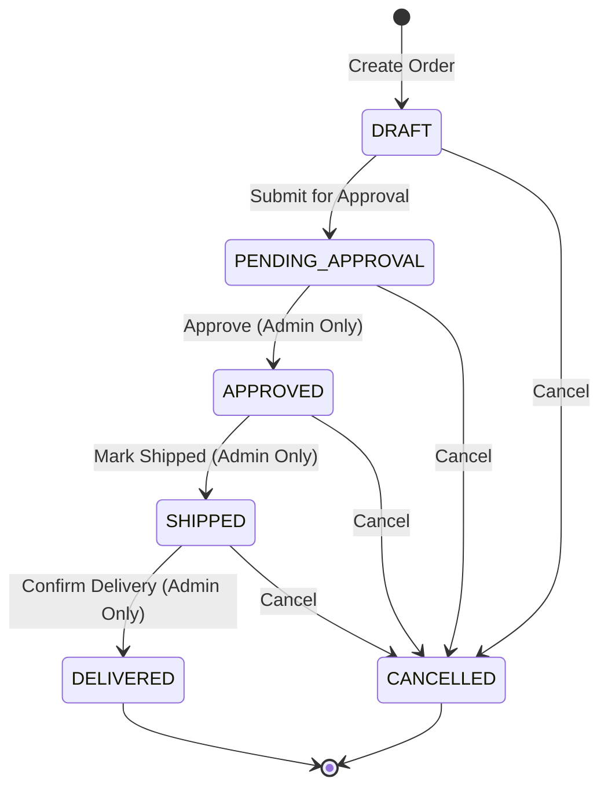
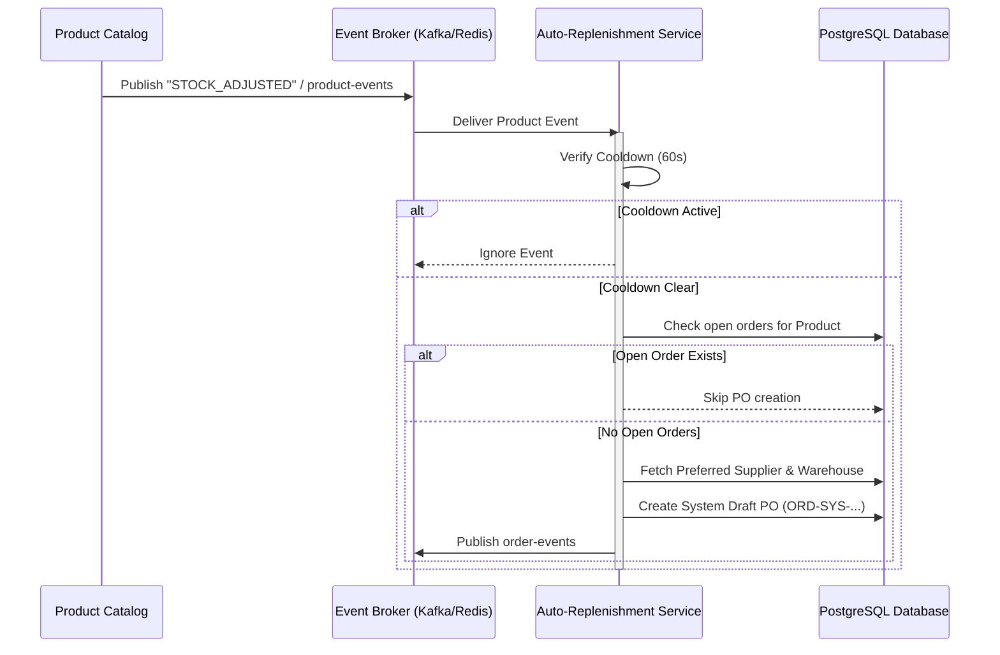

# Nexus Supply Chain

A full-stack supply chain management platform built with a Spring Boot backend, React frontend, and a supporting infrastructure of PostgreSQL, Redis, and Kafka.

---

## Tech Stack

| Layer | Technology |
|---|---|
| **Frontend** | React 19, TypeScript, Vite, Tailwind CSS v4, React Router |
| **Backend** | Spring Boot 4.1, Java 17, Spring Security (JWT), Spring Kafka, Liquibase |
| **Database** | PostgreSQL 15 |
| **Cache** | Redis 7 |
| **Messaging** | Apache Kafka 4.3 (KRaft mode) |
| **Containerization** | Docker, Docker Compose |
| **Load Testing** | k6 |

---

## Core Features

- **Role-Based Access Control (RBAC)**: Secure access using JWT for two roles:
  - `ROLE_ADMIN`: Full system access, including the Operations Dashboard and Forensic Audit Logs.
  - `ROLE_STAFF`: Read/write access to the Product Catalog and Purchase Orders, with restrictions preventing them from advancing orders beyond `DRAFT`/`PENDING_APPROVAL`.
- **Product Catalog Management**: Track SKUs, inventory stock levels, unit prices, reorder thresholds, and active status. Products are assigned to specific Warehouses and Suppliers.
- **Purchase Order Management**: Full lifecycle management of purchase orders with an enforce-valid transition Finite State Machine (FSM).
- **Auto-Replenishment Engine**: Event-driven automation that monitors stock levels. When inventory falls below the reorder threshold, it automatically creates a system draft order. Features:
  - *Rate-Limiting Cooldown*: 60-second per-product window prevents duplicate orders under heavy load.
  - *Open Order Detection*: Automatically skips order generation if there are already active open orders.
- **Debounced Cache Eviction**: Integrated Redis caching for high-read entities (Products, Categories, Warehouses). Eviction is triggered asynchronously via pub-sub events and debounced to prevent cache stampedes.
- **Forensic Audit Logs**: Immutably record all critical actions (Order Creation, Order Status Updates, Stock adjustments) with before/after state snapshots.

---

## Core Workflows

### 1. Purchase Order Lifecycle (FSM)
All purchase orders follow a strict, validated state transition flow:



- **Stock Increment**: When an order transitions to `DELIVERED`, the system automatically increments the stock levels of the ordered products in the database.
- **Permissions**: Only `ROLE_ADMIN` can transition orders into `APPROVED`, `SHIPPED`, or `DELIVERED` states.

### 2. Auto-Replenishment Workflow
The auto-replenishment process runs asynchronously based on stock levels:



### 3. Event-Driven Cache Eviction
High-read data caches are invalidated automatically using pub-sub topics:

1. **Mutation**: A product, category, or warehouse is updated or an order is delivered.
2. **Event Broadcast**: The backend publishes a domain event to the corresponding topic (`product-events`, `order-events`, etc.).
3. **Debounced Eviction**: `CacheEvictionListener` intercepts the event and schedules cache invalidation with a 1-second debounce window to prevent database query spikes during high concurrent writes.

---

## Prerequisites

Make sure the following are installed on your machine before getting started:

- [Docker Desktop](https://www.docker.com/products/docker-desktop/) (includes Docker Compose)
- [Java 17+](https://adoptium.net/) — for running the backend locally
- [Maven 3.9+](https://maven.apache.org/download.cgi) — or use the included `./mvnw` wrapper
- [Node.js 20+](https://nodejs.org/) & npm — for running the frontend locally
- [k6](https://k6.io/docs/get-started/installation/) *(optional)* — for running load tests locally

---

## Running with Docker (Recommended)

The easiest way to run the entire stack is with Docker Compose. This starts all services — database, cache, Kafka, backend, and frontend — in one command.

### 1. Clone the repository

```bash
git clone https://github.com/your-org/nexus-supply-chain.git
cd nexus-supply-chain
```

### 2. Start all services

```bash
docker compose up --build
```

> The first run will take a few minutes as Docker builds the backend and frontend images and pulls the base images.

### 3. Access the application

| Service | URL |
|---|---|
| **Frontend** | http://localhost |
| **Backend API** | http://localhost:8080 |
| **PostgreSQL** | `localhost:5432` (DB: `supply_db`) |
| **Redis** | `localhost:6379` |
| **Kafka** | `localhost:9092` |

### 4. Stop the stack

```bash
docker compose down
```

To also remove persistent volumes (database data):

```bash
docker compose down -v
```

---

## Running Locally (Without Docker)

For active development, you can run the backend and frontend locally while keeping infrastructure services (PostgreSQL, Redis, Kafka) in Docker.

### Step 1 — Start infrastructure services

Use the dedicated dev Compose file from the `docker/` directory:

```bash
docker compose -f docker/dev.docker-compose.yml up -d
```

This starts PostgreSQL on port `5432` and Redis on port `6379`.

> **Kafka:** The dev Compose file only starts Postgres and Redis. If your feature requires Kafka, start the full stack with `docker compose up -d db redis kafka` from the project root instead.

### Step 2 — Run the Backend

Navigate to the `backend/` directory and start the Spring Boot application:

```bash
cd backend

# Using the Maven wrapper (no Maven installation needed)
./mvnw spring-boot:run

# Or if you have Maven installed
mvn spring-boot:run
```

The backend reads from `application.properties` and defaults to local service addresses, so no additional environment variables are needed when running locally.

The API will be available at **http://localhost:8080**.

### Step 3 — Run the Frontend

In a separate terminal, navigate to the `frontend/` directory:

```bash
cd frontend

# Install dependencies (first time only)
npm install

# Start the dev server
npm run dev
```

The frontend will be available at **http://localhost:5173** (Vite default).

> In dev mode, the frontend talks directly to `http://localhost:8080`. In production (Docker), it goes through the nginx reverse proxy.

---

## Environment & Configuration

The backend is configured via `backend/src/main/resources/application.properties`. All sensitive values use environment variable overrides with sensible local defaults.

| Property | Env Variable | Default (Local) |
|---|---|---|
| Database URL | `SPRING_DATASOURCE_URL` | `jdbc:postgresql://localhost:5432/supply_db` |
| DB Username | `SPRING_DATASOURCE_USERNAME` | `enterprise_admin` |
| DB Password | `SPRING_DATASOURCE_PASSWORD` | `secure_dev_password` |
| Redis Host | `SPRING_REDIS_HOST` | `localhost` |
| Redis Port | `SPRING_REDIS_PORT` | `6379` |
| Kafka Servers | `SPRING_KAFKA_BOOTSTRAP_SERVERS` | `localhost:9092` |

> **Note:** The default `jwt.secret` in `application.properties` is for local development only. Always use a strong, unique secret in any non-local environment.

---

## Database Migrations

Database schema is managed by **Liquibase**, which runs automatically on application startup. Migration changelogs are located in:

```
backend/src/main/resources/db/changelog/
```

No manual migration steps are needed — Liquibase will apply any pending changesets when the backend starts.

---

## Load Testing

The project includes k6 load tests in the `load-tests/` directory. The test runner automatically detects whether k6 is installed locally or falls back to Docker.

> **Prerequisite:** The full Docker Compose stack must be running before executing load tests.

```bash
# Full load test (default profile)
./load-tests/run.sh

# Smoke test — quick sanity check (1 VU, 10 seconds)
./load-tests/run.sh smoke

# Stress test — high-load scenario
./load-tests/run.sh stress
```

---

## Project Structure

```
nexus-supply-chain/
├── backend/                  # Spring Boot application
│   ├── src/
│   │   ├── main/java/        # Application source code
│   │   └── main/resources/   # Config & Liquibase changelogs
│   ├── Dockerfile
│   └── pom.xml
├── frontend/                 # React + Vite application
│   ├── src/                  # Application source code
│   ├── Dockerfile
│   └── package.json
├── docker/
│   ├── dev.docker-compose.yml  # Dev infrastructure (Postgres + Redis only)
│   └── init.sql                # DB initialization script
├── load-tests/               # k6 load & stress tests
│   ├── k6-test.js
│   ├── stress-test.js
│   └── run.sh                # Test runner script
├── terraform/                # Infrastructure as Code
├── docs/                     # Additional documentation
└── docker-compose.yml        # Full production-like stack
```
