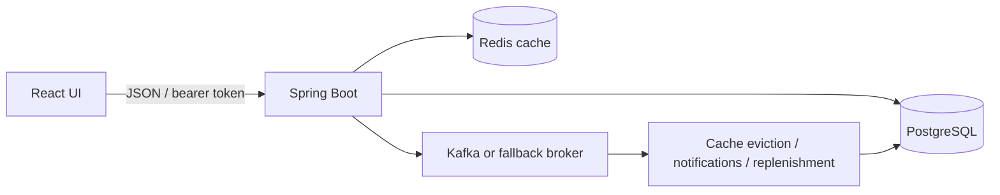

# Architecture

The React UI calls a Spring Boot API using JSON and a bearer token. PostgreSQL stores application data. Redis caches selected responses. Domain events trigger cache eviction, notifications, and draft replenishment orders.

## Deployment shapes

The root Compose file builds the React bundle into the Spring Boot JAR and includes PostgreSQL, Redis, Kafka, Prometheus, Grafana, and node-exporter. The optional frontend Dockerfile provides a separate Nginx deployment. During development, Vite proxies API requests to port 8080.

Terraform creates one App Service and a staging slot, backed by one PostgreSQL database and one Redis instance. Production and staging currently share data. Terraform does not provision Kafka, Key Vault, Log Analytics, private networking, database high availability, or deployment-slot swaps.

## Authentication and authorization

Login checks a BCrypt password hash and issues an expiring JWT. API requests validate the signature and load the active user and current role from the database. Administrators manage catalog definitions, stock adjustments, user creation, analytics, and audit views. Staff can read catalog data and create/submit orders. Notification reads and updates are scoped to the signed-in user.

The frontend keeps its token in memory and signs out on expiry or an API authentication failure. Browser route checks improve navigation; the API enforces permissions.

## Storage and consistency

Services use database transactions for stock and order mutations. Product/order row locks serialize competing updates. Audit snapshots record selected actions in the same application database; there is no database-enforced append-only or tamper-evident guarantee.

Cache eviction runs when asynchronous mutation events are consumed, so readers can briefly see older data. Redis TTLs provide a further bound on stale cache entries. If Redis is unavailable at startup, caching is disabled and reads go to the database.

Events are published after the database transaction commits. There is no transactional outbox: a process crash between commit and publish can lose an event. Redis-list consumption removes a message before handlers finish, and memory queues disappear on restart. These mechanisms should not be described as guaranteed delivery or exactly-once processing.

## Boundaries

The application has a shared staff/admin data model, not tenant isolation. Suppliers are reference records; the repository does not send orders to external suppliers. Shipment tracking, refresh-token rotation, and a dedicated stock-movement ledger are not implemented workflows, even though baseline database tables exist for some of them.
