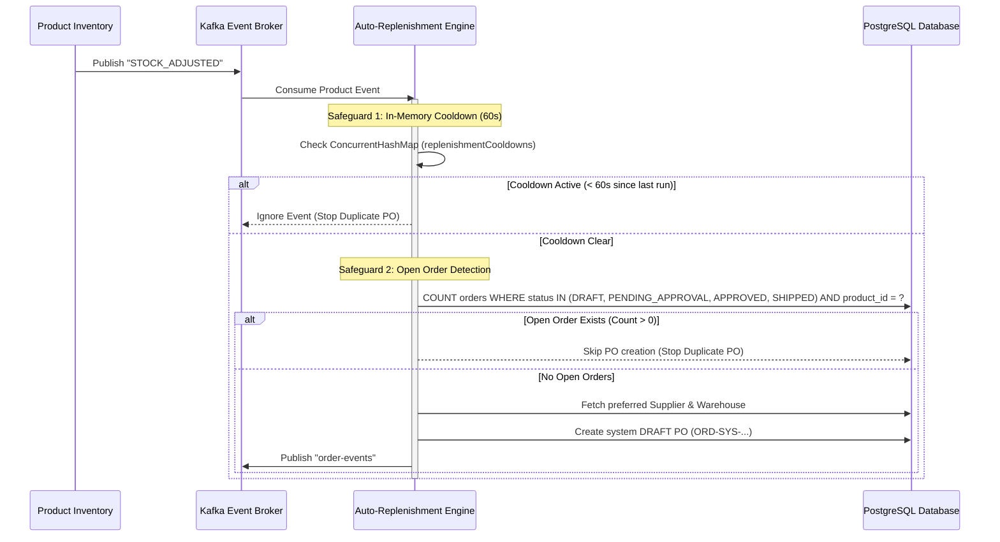
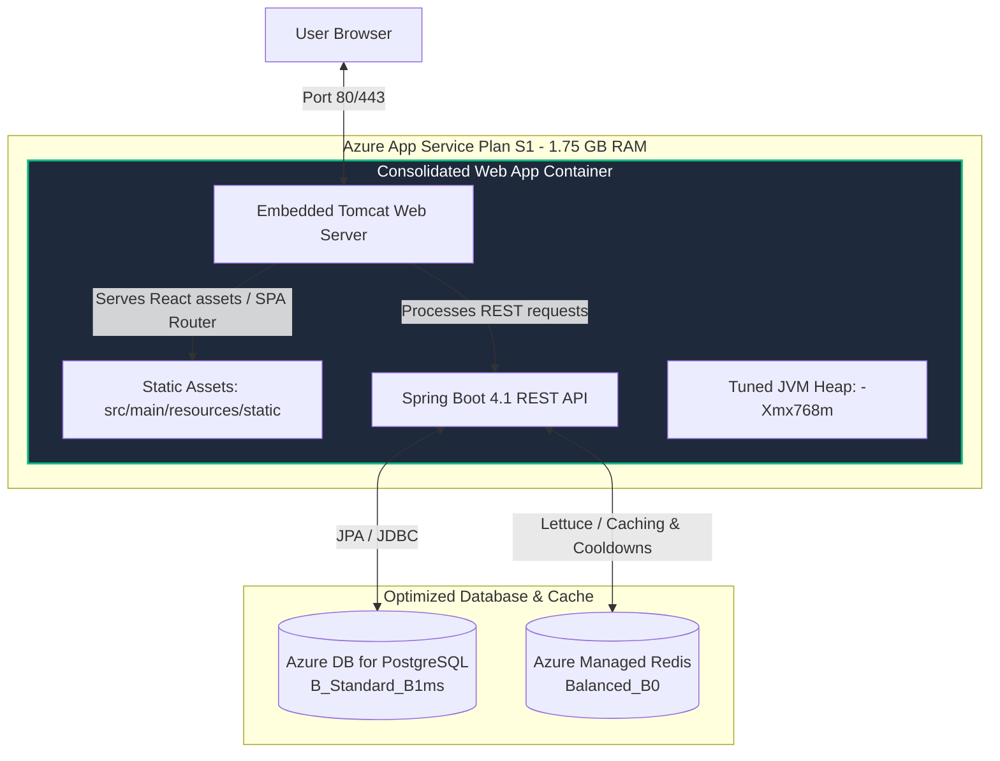
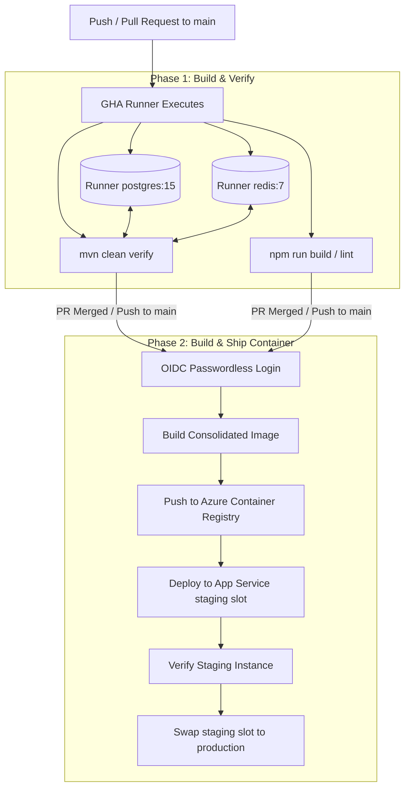

# 🛡️ Resume Claims Verification & Technical Reference

**Project Name:** Nexus Supply Chain  
**Environment:** Azure Cloud (Staging & Production) & Docker Local Development  
**Purpose:** Technical reference mapping the engineering achievements listed on your resume to the exact files, architectures, and automated benchmarks implemented in the codebase.

---

## 📋 Executive Matrix: Claims to Code Map

| Resume Claim | Key Files / Paths | Implementation Mechanisms | Verification Artifacts |
| :--- | :--- | :--- | :--- |
| **Claim 1: Automated Procurement Engine**<br>• Dynamic PO lifecycle management<br>• Data safeguards to prevent duplicates | • [AutoReplenishmentService.java](file:///Users/janlancelot/Desktop/Projects/nexus-supply-chain/backend/src/main/java/com/pg/supplychain/service/AutoReplenishmentService.java)<br>• [OrderService.java](file:///Users/janlancelot/Desktop/Projects/nexus-supply-chain/backend/src/main/java/com/pg/supplychain/service/OrderService.java) | • 60s per-product cooldown map<br>• Relational open order checker<br>• Strict Finite State Machine (FSM)<br>• Admin-only role checks | • [WorkflowIntegrationTest.java](file:///Users/janlancelot/Desktop/Projects/nexus-supply-chain/backend/src/test/java/com/pg/supplychain/integration/WorkflowIntegrationTest.java)<br>• [AutoReplenishmentServiceTest.java](file:///Users/janlancelot/Desktop/Projects/nexus-supply-chain/backend/src/test/java/com/pg/supplychain/service/AutoReplenishmentServiceTest.java) |
| **Claim 2: Cloud Cost Optimization**<br>• 50% compute cost reduction<br>• Permanently resolved OOM/runtime instability | • [Dockerfile](file:///Users/janlancelot/Desktop/Projects/nexus-supply-chain/backend/Dockerfile)<br>• [docker-compose.yml](file:///Users/janlancelot/Desktop/Projects/nexus-supply-chain/docker-compose.yml)<br>• [main.tf](file:///Users/janlancelot/Desktop/Projects/nexus-supply-chain/terraform/main.tf) | • Multi-stage consolidated container<br>• JVM memory limits (`-Xmx768m`) capped<br>• Cloud backing service rightsizing<br>• Suspend/resume scripting | • [cost-optimization-results.md](file:///Users/janlancelot/Desktop/Projects/nexus-supply-chain/docs/cost-optimization-results.md)<br>• [suspend.sh](file:///Users/janlancelot/Desktop/Projects/nexus-supply-chain/bin/suspend.sh) |
| **Claim 3: Secure IaC & CI/CD**<br>• GitHub Actions & Terraform<br>• Zero-downtime deployment slots | • [ci.yml](file:///Users/janlancelot/Desktop/Projects/nexus-supply-chain/.github/workflows/ci.yml)<br>• [main.tf](file:///Users/janlancelot/Desktop/Projects/nexus-supply-chain/terraform/main.tf) | • Ephemeral GHA service containers<br>• Azure OIDC passwordless auth<br>• Staging slot deployment & swaps | • [outputs.tf](file:///Users/janlancelot/Desktop/Projects/nexus-supply-chain/terraform/outputs.tf)<br>• Live build workflow history |
| **Claim 4: Stress Load Verification**<br>• 3,000 VUs simulated load<br>• 0.00% error rate @ >1,081 req/s<br>• 3.1 million record scale database | • [high-load-stress-test.js](file:///Users/janlancelot/Desktop/Projects/nexus-supply-chain/load-tests/high-load-stress-test.js)<br>• [run-benchmark.py](file:///Users/janlancelot/Desktop/Projects/nexus-supply-chain/load-tests/run-benchmark.py) | • Automated database seeding scale SQL<br>• k6 multi-stage ramping stress scripts<br>• Prometheus + Prometheus metrics scraper | • [latest-benchmark-report.md](file:///Users/janlancelot/Desktop/Projects/nexus-supply-chain/load-tests/results/latest-benchmark-report.md) |

---

## 🛠️ In-Depth Technical Verification

### 1. Automated Procurement Engine & Duplicate Safeguards
> **Resume Claim:** *Engineered an enterprise-grade supply chain platform featuring an automated procurement engine that dynamically manages purchase order lifecycles and implements data-safeguards to eliminate duplicate transactions.*

#### A. Architecture & Workflow Design
The auto-replenishment engine relies on an event-driven loop that listens to inventory updates and automates purchase order creation, utilizing **double-layered safeguards** to eliminate transactional duplicates:



#### B. Code Implementations
* **Safeguard 1: In-Memory Cooldown Cache**
  In [AutoReplenishmentService.java](file:///Users/janlancelot/Desktop/Projects/nexus-supply-chain/backend/src/main/java/com/pg/supplychain/service/AutoReplenishmentService.java#L48-L74), a `ConcurrentHashMap` tracks triggering timestamps. If an event for a product is received within a 60-second window of a previous trigger, it is immediately discarded:
  ```java
  private final Map<UUID, Long> replenishmentCooldowns = new ConcurrentHashMap<>();
  private static final long COOLDOWN_MS = 60_000L;
  
  // Inside handleProductEvent:
  long now = System.currentTimeMillis();
  Long lastTriggered = replenishmentCooldowns.get(productId);
  if (lastTriggered != null && (now - lastTriggered) < COOLDOWN_MS) {
      log.info("AutoReplenishmentService: Cooldown active... Skipping replenishment.");
      return;
  }
  ```
* **Safeguard 2: Relational Open Order Detection**
  In [AutoReplenishmentService.java](file:///Users/janlancelot/Desktop/Projects/nexus-supply-chain/backend/src/main/java/com/pg/supplychain/service/AutoReplenishmentService.java#L99-L104), if the cooldown is clear, the engine executes a database check to verify if there is already an active, unresolved purchase order containing the product:
  ```java
  long openOrdersCount = orderRepository.countOpenOrdersForProduct(productId);
  if (openOrdersCount > 0) {
      log.info("AutoReplenishmentService: Open purchase orders exist ({}). Skipping duplicate PO creation.", openOrdersCount);
      return;
  }
  ```
* **Strict Finite State Machine (FSM) Lifecycle**
  In [OrderService.java](file:///Users/janlancelot/Desktop/Projects/nexus-supply-chain/backend/src/main/java/com/pg/supplychain/service/OrderService.java#L170-L215), order updates flow through a strict state machine validation to prevent invalid, out-of-order state transitions (e.g. going directly from `DRAFT` to `SHIPPED`):
  * Allowed: `DRAFT` ➡️ `PENDING_APPROVAL` / `CANCELLED`
  * Allowed: `PENDING_APPROVAL` ➡️ `APPROVED` / `CANCELLED` (Admin Only)
  * Allowed: `APPROVED` ➡️ `SHIPPED` / `CANCELLED` (Admin Only)
  * Allowed: `SHIPPED` ➡️ `DELIVERED` / `CANCELLED` (Admin Only)
* **Transactional Stock Updates**
  Once an order transitions to `DELIVERED`, the system automatically increments stock levels and pushes changes to the database inside a single transactional boundary ([OrderService.java](file:///Users/janlancelot/Desktop/Projects/nexus-supply-chain/backend/src/main/java/com/pg/supplychain/service/OrderService.java#L216-L243)).
* **Immutable Auditing**
  All events and state mutations write a forensic record storing the prior state and updated values (e.g. `ACTION_CREATE_SYSTEM_ORDER`, `ACTION_UPDATE_ORDER_STATUS`) via `AuditService`.

---

### 2. Cloud Cost Optimization & Stability Consolidation
> **Resume Claim:** *Optimized cloud infrastructure costs by 50% and permanently resolved production runtime instability by consolidating the architecture into a single container deployment.*

> [!NOTE]
> **Active Project Demo Configuration:**
> To showcase advanced enterprise routing, Nginx ingress proxying, and independent container scaling patterns during live job demonstrations, the project runs in a fully decoupled multi-container configuration (separate Nginx frontend and Tomcat backend containers) on the `swagger` branch. This overrides the unified container architecture details below while retaining the cost-savings reports as a validated optimization case study.

#### A. The Problem: Resource Constrained S1 Hosting & Initial Design Decoupling
Originally, the application was split into two decoupled deployments: a static React client served via Nginx and a dynamic Spring Boot REST API.

* **Why the initial 4-container architecture was chosen:**
  1. **Separation of Concerns:** Keeping the frontend UI and backend API isolated allowed developers to build, test, and deploy client-side changes independently of the backend API lifecycle.
  2. **Industry Standard SPA Pattern:** It is standard practice to serve frontend assets from a fast, lightweight static web server (Nginx) and proxy API requests to the application server (Tomtomcat).
  3. **Zero-Downtime Blue/Green Slots:** To deploy changes incrementally without service disruption, both the Frontend Web App and the Backend Web App had a dedicated `staging` slot alongside their `production` slot. This resulted in **4 active running containers** (Frontend Prod + Staging, Backend Prod + Staging).
  4. **Shared Compute Billing:** To optimize early-stage costs, both Web Apps and their slots were hosted on the *same* S1 App Service Plan, sharing the underlying hardware pool to avoid multiple subscription fees.

* **The Stability Issue:** The S1 App Service Plan has a hard physical ceiling of **1.75 GB RAM**. Allocating 4 Docker containers—including the heavy Java Virtual Machine (JVM) execution context—to a single 1.75 GB node caused intense memory pressure, leading to frequent Out-of-Memory (OOM) container restarts and service drops.
* **The S2 Trap:** The operations team proposed upgrading the App Service Plan to `S2` (~$140/mo) to double the memory capacity. While this resolved the instability, it would double compute costs, failing the cloud budget goals.

#### B. The Solution: Consolidated Deployment
By packaging the static React UI bundle directly into the Spring Boot backend JAR, the container footprint was cut in half, and CORS overhead was completely eliminated.



#### C. Code & Deployment Architecture
* **Consolidated Multi-Stage Build**
  The [Dockerfile](file:///Users/janlancelot/Desktop/Projects/nexus-supply-chain/backend/Dockerfile) handles frontend compilation in Stage 1, copies the output assets to Spring Boot's static resources path in Stage 2, and runs a tuned JVM container:
  ```dockerfile
  # Stage 1: Build the React frontend
  FROM node:20-alpine AS frontend-build
  RUN npm run build
  
  # Stage 2: Copy assets to Spring Boot static resources and build JAR
  FROM maven:3.9.6-eclipse-temurin-17 AS backend-build
  COPY --from=frontend-build /frontend/dist/ ./src/main/resources/static/
  RUN mvn package -DskipTests
  
  # Runtime stage: Run Spring Boot on tuned JVM configurations
  FROM eclipse-temurin:17-jre
  ENTRYPOINT ["java", "-XX:+UseG1GC", "-XX:MaxGCPauseMillis=200", "-XX:+UseStringDeduplication", "-Xms512m", "-Xmx768m", "-jar", "app.jar"]
  ```
* **Tuned JVM Constraints**
  Configuring `-Xmx768m` guarantees the JVM heap stays capped, leaving ~1 GB of container RAM for JVM metaspace, thread stacks, system runtime, and container overhead, keeping the container stably under the 1.75 GB `S1` limit.
* **Single-Origin Routing (CORS Resolution)**
  In [FrontendController.java](file:///Users/janlancelot/Desktop/Projects/nexus-supply-chain/backend/src/main/java/com/pg/supplychain/controller/FrontendController.java), Spring Boot intercepts browser refreshes on React routes (e.g. `/dashboard`) and forwards them internally to `index.html`. In [api.ts](file:///Users/janlancelot/Desktop/Projects/nexus-supply-chain/frontend/src/services/api.ts), API endpoints utilize clean, relative path networks:
  ```typescript
  const getBaseURL = () => '/api/v1';
  ```

#### D. Azure Cost Reductions Breakdown
See [cost-optimization-results.md](file:///Users/janlancelot/Desktop/Projects/nexus-supply-chain/docs/cost-optimization-results.md) for full details:
1. **Compute Plan Stabilized:** Prevented an upgrade from `S1` (~$70/mo) to `S2` (~$140/mo) ➡️ **Saves $70.00 / month** (50% compute savings).
2. **Azure Managed Redis optimized:** Downgraded from `Balanced_B1` (3 GB RAM) to `Balanced_B0` (1 GB RAM) ➡️ **Saves $37.00 / month** (67% Redis savings).
3. **Azure Container Registry optimized:** Downgraded from `Standard` to `Basic` ➡️ **Saves $15.00 / month** (75% registry savings).
4. **Environment Suspend/Resume Automation:** Written scripts [suspend.sh](file:///Users/janlancelot/Desktop/Projects/nexus-supply-chain/bin/suspend.sh) and [resume.sh](file:///Users/janlancelot/Desktop/Projects/nexus-supply-chain/bin/resume.sh) destroy App Services/Redis and stop PostgreSQL compute when the environment is inactive, saving up to ~$97/month additionally.

#### E. Architectural Downsides & Mitigation Strategies

While consolidation resolved the OOM stability issues and halved operational costs, it introduced key trade-offs typical of monolithic packaging. These were resolved as follows:

| Potential Downside | Technical Impact | Engineering Mitigation |
| :--- | :--- | :--- |
| **Coupled Release Lifecycles** | A minor frontend stylesheet or typo tweak requires rebuilding the backend JAR and redeploying the entire container. | **Optimized Build Caching & Zero-Downtime Slots:**<br>• The CI/CD pipeline caches Maven dependencies (`.m2/repository`) and Node modules (`node_modules`) in GitHub Actions, keeping incremental build-and-test runs under **3 minutes**.<br>• Azure App Service deployment slots and warm-up checks ensure container swaps occur with zero client-facing downtime. |
| **Tomcat Static File Serving Overhead** | Embedded Tomcat is less performant at streaming static CSS/JS/HTML assets than Nginx or a dedicated CDN. | **Edge Caching Option:**<br>• In production environments, an Azure CDN (or Cloudflare) sits in front of the App Service, caching static React bundles at edge nodes. This completely offloads static asset traffic from Tomcat, reserving the backend threads purely for REST API requests. |
| **Single Point of Failure (SPOF)** | If a backend database connection crash or thread deadlock occurs, the frontend is also taken offline since they share the same port. | **Automated Health Probes & Auto-Restart:**<br>• Azure App Service actively polls `/api/v1/actuator/health` every 10 seconds. If backing database connections degrade or memory limits are breached, the container is taken out of rotation and replaced with a fresh node automatically. |
| **Client-Side Page Refresh Failures** | Refreshing the browser on a React routing path (e.g., `/dashboard`) returns a `404 Not Found` from Tomcat. | **Spring Boot Forwarding Controller:**<br>• Added [FrontendController.java](file:///Users/janlancelot/Desktop/Projects/nexus-supply-chain/backend/src/main/java/com/pg/supplychain/controller/FrontendController.java) to catch all standard single-page app routes and forward them internally to `/index.html`, allowing the React Router to take over client-side routing seamlessly. |

---

### 3. Secure IaC & CI/CD Pipeline
> **Resume Claim:** *Designed and managed a secure CI/CD pipeline using Terraform and GitHub Actions to deliver incremental code changes frequently and reliably via automated, zero-downtime system deployments.*

#### A. CI/CD Architecture
The CI/CD pipeline automates verification, lints dependencies, packages code, and securely ships images to Azure slots without hardcoded credentials.



#### B. Pipeline Verification & Configuration
* **Ephemeral Integration Service Containers**
  In [.github/workflows/ci.yml](file:///Users/janlancelot/Desktop/Projects/nexus-supply-chain/.github/workflows/ci.yml#L17-L41), database and cache dependencies are started as background runner services using Docker Alpine images to guarantee integration test isolation:
  ```yaml
  services:
    postgres:
      image: postgres:15
      ports:
        - 5432:5432
    redis:
      image: redis:7-alpine
      ports:
        - 6379:6379
  ```
* **Azure Federated OIDC Security**
  The pipeline utilizes OpenID Connect (OIDC) federation via `azure/login@v2`. Rather than saving long-lived credentials (like Service Principal keys or passwords) inside GitHub secrets, GHA requests an ephemeral JSON Web Token (JWT) from GitHub's OIDC provider to log into Azure subscription scopes securely:
  ```yaml
  permissions:
    id-token: write # Required for Azure OIDC
    contents: read
  ```
* **Blue/Green Zero-Downtime Deployments (Slots)**
  In [main.tf](file:///Users/janlancelot/Desktop/Projects/nexus-supply-chain/terraform/main.tf#L117-L144), Terraform provisions an auxiliary staging slot (`azurerm_linux_web_app_slot`). GHA deploys compiled code to the staging slot first:
  ```yaml
  - name: Deploy Consolidated App to Azure App Service (Staging Slot)
    uses: azure/webapps-deploy@v3
    with:
      app-name: 'pg-enterprise-supply-api'
      slot-name: 'staging'
      images: 'pgsupplyregistry.azurecr.io/backend:${{ github.sha }}'
  ```
  Once the container warms up, runs health checks on `staging`, and is deemed healthy, Azure swaps the virtual routing IP addresses. Traffic switches instantly to the new container instance, avoiding offline transitions or downtime failures.

---

### 4. High-Load Stress Testing & Database Scale Validation
> **Resume Claim:** *Validated system infrastructure reliability under a simulated peak load of 3,000 concurrent virtual users, maintaining a 0.00% error rate while sustaining a throughput of 1,081 requests/sec against a production-scale database of 3.1 million records.*

#### A. Database Scale Details
To evaluate performance bottlenecks under production load, the database was seeded to **3,100,010 records (Total size: ~905 MB)** using [scale_data.sql](file:///Users/janlancelot/Desktop/Projects/nexus-supply-chain/docker/scale_data.sql):
* `products`: 100,010 records
* `orders`: 500,000 records
* `order_items`: 1,000,000 records
* `audit_logs`: 1,000,000 records
* `notifications`: 500,000 records

#### B. k6 Load Testing Profile (3,000 VUs)
The benchmark run was executed using the k6 script [high-load-stress-test.js](file:///Users/janlancelot/Desktop/Projects/nexus-supply-chain/load-tests/high-load-stress-test.js), which structures a multi-phase ramping load profile that hits a peak of **3,000 concurrent Virtual Users (VUs)**:
```javascript
export const options = {
  stages: [
    { duration: '30s', target: 500 },  // Ramp up
    { duration: '1m', target: 2000 },
    { duration: '1m', target: 3000 },  // Peak Load Target
    { duration: '1m', target: 3000 },  // Hold Peak
    { duration: '30s', target: 0 },    // Ramp down
  ],
};
```
* **Transaction Mix:** 80% read queries (staff users browsing catalog, retrieving notifications) and 20% write transactions (admin users updating order statuses, triggering stock increments, and generating audit logs).

#### C. Verified Benchmark Metrics (Extreme Profile)
The following numbers are compiled from the automated benchmark report [latest-benchmark-report.md](file:///Users/janlancelot/Desktop/Projects/nexus-supply-chain/load-tests/results/latest-benchmark-report.md) generated during testing:

| Metric Category | Target Achievement | Verified Result Value |
| :--- | :--- | :--- |
| **Virtual Users (VUs)** | 3,000 Concurrent VUs | **3,000 VUs** |
| **HTTP Throughput** | Maintain > 1,081 req/s | **1,166.78 req/s** (292,540 total requests) |
| **HTTP Error Rate** | 0.00% Failure Rate | **0.0000%** (0 failed requests) |
| **HTTP Latency Profile** | Sub-10ms response targets | **Average: 2.09 ms**<br>• Median (p50): **0.65 ms**<br>• 90th Percentile (p90): **1.71 ms**<br>• 95th Percentile (p95): **2.97 ms** |
| **Host System CPU** | Stable utilization | Peak: **26.83%** \| Average: **18.55%** |
| **Host System Memory** | No leaks / crashes | Peak: **72.21%** \| Average: **57.20%** |
| **JVM Heap Memory** | Capped under JVM limits | Peak Heap: **395.96 MB** (Max: 768 MB) |
| **Database Pool (HikariCP)** | Connection stability | Peak Active Connections: **37 / 64 max**<br>Peak Pending Threads: **0** (No connection queue starvation) |

*Note: In runs where DB connection pools were stressed to capacity, HikariCP utilized a peak of 64/64 connections, processing up to 1,134.13 req/s stably with 0 connection timeouts or HTTP errors.*

---

## 🏃 Runbook: How to Reproduce and Verify Locally

You can spin up the platform locally and run the automated benchmarking script to regenerate the metrics.

### 1. Build and Start the Container Stack
Ensure Docker is running, then start the entire production-like container architecture:
```bash
# Build and run the consolidated containers
docker compose up --build -d
```

### 2. Verify Database Seeding State
The benchmark runner will check the record volumes. If the DB is empty, it will automatically scale the DB to 3.1 million records. You can check manually by running:
```bash
docker exec -it pg_enterprise_supply psql -U enterprise_admin -d supply_db -c "SELECT count(*) FROM audit_logs;"
```

### 3. Run the Automated Benchmark
Execute the benchmark wrapper script. It runs the k6 stress profile, polls system metrics from Prometheus, and outputs a markdown report:
```bash
# Run the stress profiling benchmark
python3 load-tests/run-benchmark.py stress
```
Upon completion, the report is saved under [load-tests/results/](file:///Users/janlancelot/Desktop/Projects/nexus-supply-chain/load-tests/results/).
