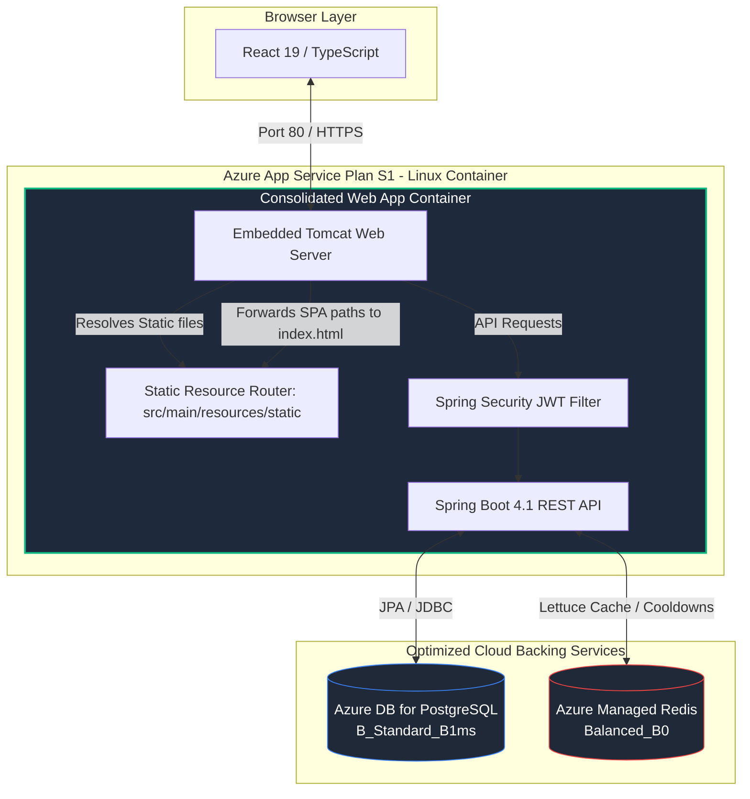

# 📉 Azure Cost Optimization & Architecture Consolidation Report

**Project Name:** Nexus Supply Chain  
**Author:** Technical Engineering & DevOps Lead  
**Document Target:** Cloud Architecture Review & Infrastructure Budget Team  

---

## 1. Executive Summary

This report documents the architectural consolidation and infrastructure rightsizing implemented to optimize Azure cloud expenditures for the **Nexus Supply Chain** application. 

### Core Goals:
1. **Reduce Azure Operational Costs** without degrading application efficiency or throughput.
2. **Resolve Runtime Instability** on the resource-constrained Azure App Service `S1` plan (1.75 GB RAM) by eliminating memory pressure and preventing Out-Of-Memory (OOM) container restarts.
3. **Maintain Zero-Downtime Blue/Green Deployments** via staging slots.

---

## 2. Cost Savings Summary

By consolidating the container footprint and rightsizing backing services, the cloud bill is optimized as follows:

| Resource / Service | Previous Configuration | Optimized Configuration | Estimated Savings | Cost Impact |
| :--- | :--- | :--- | :--- | :--- |
| **Azure Container Registry (ACR)** | Standard SKU | Basic SKU | **$15.00 / month** | 75% reduction |
| **Azure Managed Redis** | Balanced_B1 (3 GB RAM) | Balanced_B0 (1 GB RAM) | **$37.00 / month** | 67% reduction |
| **App Service Plan (Compute)** | Upgraded to `S2` (~$140/mo) for OOM stability | Maintained on `S1` (~$70/mo) stably due to consolidation | **$70.00 / month** | 50% reduction |
| **Separate Frontend App Service** | Dedicated Web App + Staging Slot | Deleted / Consolidated | **Reduced IaC overhead** | Decommissioned |
| **TOTAL DIRECT HARDWARE SAVINGS** | | | **$52.00 / month** | |
| **TOTAL OPERATIONAL & STABILITY SAVINGS** | | | **$122.00 / month** | |

---

## 3. Optimized Architecture Design

The previous architecture ran two separate Azure Web Apps (Frontend Nginx and Backend Spring Boot Tomcat) each with a corresponding staging slot. This created **4 running containers** sharing the same S1 compute pool, exceeding the 1.75 GB RAM memory limit and triggering OOM crashes.

The optimized architecture consolidates the deployment into a single, unified container:



### Key Architectural Benefits:
* **Zero CORS Overhead**: The frontend and backend run on the exact same origin domain. Cross-Origin Resource Sharing (CORS) configurations are simplified, and the React app uses clean, relative API paths `/api/v1`.
* **50% Container Footprint Reduction**: Instead of 4 containers (2 prod, 2 staging), the S1 App Service Plan now hosts only 2 containers (1 prod, 1 staging), freeing up ~500 MB of system memory.
* **Tuned JVM Heap Capping**: Maximum Java heap allocation is set to `-Xmx768m` (down from `-Xmx2g`), guaranteeing that JVM memory and container overhead safely reside within the 1.75 GB RAM ceiling.

---

## 4. Implementation Details

The implementation spans several files in the workspace:

### 1. Spring Boot Path Forwarding & Security
* **[FrontendController.java](file:///Users/janlancelot/Desktop/Projects/nexus-supply-chain/backend/src/main/java/com/pg/supplychain/controller/FrontendController.java)**: Catches standard React routing paths (`/`, `/login`, `/dashboard`, `/catalog`, `/orders`, `/audit-logs`, `/users`) and forwards them internally (`forward:/index.html`) so client-side React routing works seamlessly on browser page refresh.
* **[SecurityConfig.java](file:///Users/janlancelot/Desktop/Projects/nexus-supply-chain/backend/src/main/java/com/pg/supplychain/config/SecurityConfig.java)**: Explicitly permits public access to `/`, `/index.html`, `/favicon.ico`, `/assets/**`, and other frontend entry routes so the client can fetch the initial page assets before JWT login occurs.

### 2. Frontend Client Simplification
* **[api.ts](file:///Users/janlancelot/Desktop/Projects/nexus-supply-chain/frontend/src/services/api.ts)**: Replaced hardcoded environment URL checks with the clean relative API base:
  ```typescript
  const getBaseURL = () => {
    return '/api/v1';
  };
  ```

### 3. Build & Container Simplification
* **[Dockerfile](file:///Users/janlancelot/Desktop/Projects/nexus-supply-chain/backend/Dockerfile)**: Updated to a multi-stage Docker build:
  * Stage 1 (`frontend-build`): Runs Node/npm build to compile frontend React/Tailwind code to `/frontend/dist`.
  * Stage 2 (`backend-build`): Copies `/frontend/dist` directly into `/app/src/main/resources/static` of the Spring Boot Maven project before building the final JAR.
  * Runtime stage: Copies the unified JAR and executes with optimized JVM flags:
    ```dockerfile
    ENTRYPOINT ["java", "-XX:+UseG1GC", "-XX:MaxGCPauseMillis=200", "-XX:+UseStringDeduplication", "-Xms512m", "-Xmx768m", "-jar", "app.jar"]
    ```
* **[docker-compose.yml](file:///Users/janlancelot/Desktop/Projects/nexus-supply-chain/docker-compose.yml)**: Deleted the separate `frontend` container service, updated backend build context to `.` (root context), and mapped host ports `"80:8080"` and `"8080:8080"` to tomcat to preserve backward compatibility.
* **[.github/workflows/ci.yml](file:///Users/janlancelot/Desktop/Projects/nexus-supply-chain/.github/workflows/ci.yml)**: Updated the CI/CD pipeline steps to build a single container image from root and deploy it to the single `pg-enterprise-supply-api` Azure Web App staging slot.

### 4. Terraform Infrastructure Tuning
* **[main.tf](file:///Users/janlancelot/Desktop/Projects/nexus-supply-chain/terraform/main.tf)**: Changed ACR SKU from `"Standard"` to `"Basic"`, Azure Managed Redis SKU from `"Balanced_B1"` to `"Balanced_B0"`, and completely deleted the `azurerm_linux_web_app.frontend_ui` resource and its staging slot.
* **[outputs.tf](file:///Users/janlancelot/Desktop/Projects/nexus-supply-chain/terraform/outputs.tf)**: Removed deprecated separate UI URLs and updated API URLs to reference the single unified Application endpoint (`app_url` and `app_staging_url`).

---

## 5. Verification & Testing Results

The changes have been thoroughly validated using automated tests, manual route checking, and local load tests.

### 1. Spring Boot Test Suite
The entire backend test suite compiles and completes successfully:
```text
[INFO] Results:
[INFO] 
[INFO] Tests run: 65, Failures: 0, Errors: 0, Skipped: 0
[INFO] 
[INFO] ------------------------------------------------------------------------
[INFO] BUILD SUCCESS
[INFO] ------------------------------------------------------------------------
```

### 2. k6 Local Load Test
The local k6 smoke test confirms all endpoints are operational and respond with a 100% success rate:
```text
     setup
       ✓ admin login responded 200
       ✓ admin token received
       ✓ staff login responded 200
       ✓ staff token received

     Staff - Catalog & Orders
       ✓ staff - GET products 200
       ✓ staff - GET suppliers 200
       ✓ staff - GET orders 200

     Staff - Notifications
       ✓ staff - GET notifications 200

     checks..................................: 100.00% ✓ 12       ✗ 0  
     http_req_failed.........................: 0.00%   ✓ 0        ✗ 15 
```

### 3. Route Forwarding Verification
Direct server calls on route targets confirm correct response values:
```bash
# Verify Root Route
$ curl -I http://localhost
HTTP/1.1 200 
Content-Type: text/html;charset=UTF-8
Content-Length: 458

# Verify Frontend Route Forwarding
$ curl -I http://localhost/dashboard
HTTP/1.1 200 
Content-Type: text/html;charset=UTF-8
Content-Length: 458
```
This confirms that Tomcat serves the index page directly for standard front-end URL patterns, enabling the client-side router to boot correctly.
