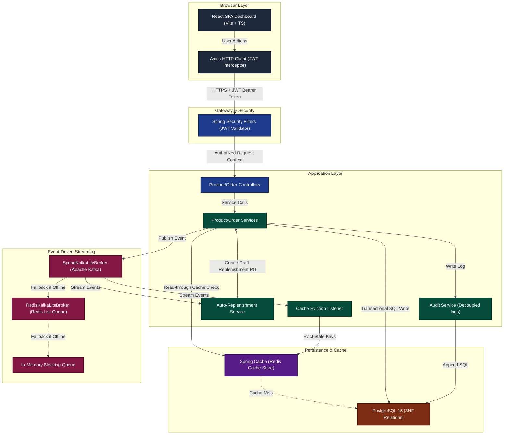
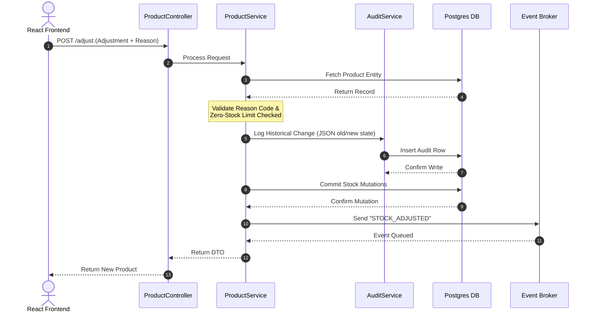
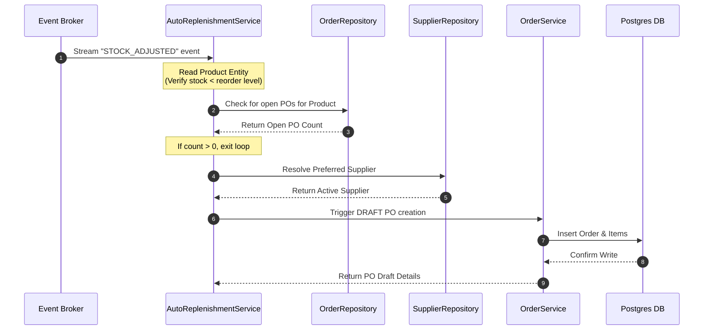

# 🔄 End-to-End Data Flow & System Integration

**Project Name:** Nexus Supply Chain  
**Document Target:** Engineering Alignment & Technical Onboarding  
**Design Standard:** Systems Integration & Sequence Modeling

---

## 1. System Overview & Technology Stack

The **Nexus Supply Chain** platform is built on a decoupled, state-of-the-art architecture designed for high throughput, data consistency, and resilience. 

*   **Frontend (SPA):** React 19, TypeScript, Vite, Tailwind CSS v4, Axios.
*   **Backend (API Services):** Spring Boot 4.1, Spring Security (Stateless JWT), Spring JPA / Hibernate, Liquibase.
*   **Infrastructure Ledger:** PostgreSQL 15 (Relational persistence), Redis 7 (Distributed caching and queue fallback), Apache Kafka 4.3 (Event-driven streaming in KRaft mode).

---

## 2. End-to-End Architecture & Data Flow Diagram

The diagram below illustrates how data and control flow across the SPA frontend, the API gateway, the transactional services, the relational databases, and the event-driven queue infrastructure.



---

## 3. Key Integration Flows

### 3.1 Stateless JWT Authentication & Security Context

To eliminate server-side session tracking and maximize application scaling potential, authorization uses a secure, stateless Token pattern:

1.  **Authentication Request:** The user submits credentials (email/password) on the React login screen.
2.  **API Validation:** The request reaches `AuthController` on the backend. The system pulls the matching record from PostgreSQL and verifies the password hash using **BCrypt**.
3.  **Token Issuance:** If valid, the backend compiles a cryptographically signed JSON Web Token (JWT) payload with authorization scopes (e.g., `ROLE_ADMIN` or `ROLE_STAFF`) valid for 60 minutes.
4.  **Local Storage:** The React SPA stores the token in `localStorage`.
5.  **Outbound Requests:** An Axios request interceptor (`api.ts`) automatically extracts the token and embeds it as a Bearer structure:
    ```http
    Authorization: Bearer <JWT_TOKEN>
    ```
6.  **Backend Verification:** For each request, Spring Security filters intercept the call, validate the cryptographic signature, and establish the user's role context for resource protection. If a `401 Unauthorized` response occurs, an Axios response interceptor automatically purges local credentials and redirects the browser to `/login`.

---

### 3.2 Inventory Adjustments & Audit Trail Ingestion

Every modification to inventory levels undergoes strict transactional scoping and automated audit tracking:



1.  **Request Execution:** An administrator issues an stock adjustment (e.g., subtracting damaged goods) on the dashboard UI.
2.  **Validation Enforcements:** `ProductService` verifies the request parameters against a strict set of system reason codes (`CYCLIC_COUNT_DISCREPANCY`, `DAMAGED_GOODS_SCRAP`, `SUPPLIER_SHORTAGE`) and database constraints (preventing stock levels from falling below zero).
3.  **Audit Capturing:** Before saving the change, `AuditService.logChange` extracts original entity variables, serializes the before-and-after states to JSON string payloads, matches the active actor UUID from the security context thread, and inserts a compliance trace in `audit_logs`.
4.  **Database Commit:** The transaction is finalized on the database, committing changes safely.
5.  **Event Broadcast:** The system broadcasts a `ProductEvent` containing the product ID and the action (`STOCK_ADJUSTED`) via the message broker.

---

### 3.3 Event-Driven Caching & Automatic Eviction

To keep query performance under 10ms for heavy list lookups while maintaining eventual consistency across clients, the system uses reactive cache invalidation:

1.  **Read-Through Cache:** Product listings read from the database and populate a Redis cache namespace (`products::all`). Subsequent list requests bypass PostgreSQL entirely and read directly from Redis.
2.  **State Mutation Event:** When any stock quantity or catalog definition changes, the system fires a `ProductEvent` or `OrderEvent` to `KafkaLiteBroker`.
3.  **Asynchronous Listening:** The `CacheEvictionListener` intercepts these messages from the event stream.
4.  **Dynamic Eviction:** Depending on the event contents, the listener identifies and purges the stale cache partitions:
    *   **ProductEvent:** Evicts the `products` and `analytics` cache partitions.
    *   **OrderEvent (Delivered):** Evicts the `analytics` and `products` cache partitions to update stock counts.
    *   **CategoryEvent / WarehouseEvent:** Evicts the `categories` or `warehouses` partitions respectively.

---

### 3.4 Low Stock Auto-Replenishment Loop

To guarantee inventory continuity, the system listens to stock level events and automatically drafts procurement orders when levels drop below thresholds:



1.  **Trigger:** A change in stock levels triggers a `ProductEvent` payload sent to the broker.
2.  **Verification:** The `AutoReplenishmentService` picks up the event, pulls the product record, and validates:
    *   Is the product active in the catalog?
    *   Is the stock level strictly below the `reorderLevel` threshold?
3.  **Duplicate Protection:** The service queries `OrderRepository` to check if a pending or open Purchase Order already exists for this product. If a PO is already in flight, execution exits to prevent duplicate ordering.
4.  **Routing resolution:** The service queries `SupplierRepository` to find the preferred supplier for that product and resolves the target storage warehouse.
5.  **Draft Purchase Order Generation:** The service automatically invokes the `OrderService.createSystemOrder` routine to generate a new Purchase Order in a **DRAFT** status, preparing it for admin approval.

---

## 4. Resilience & Fallback Infrastructure Matrix

The application's messaging infrastructure is designed to run reliably in production environments, local development servers, and offline automated testing environments via a three-tiered fallback strategy:

| Mode | Event Broker Layer | Caching Layer | Intended Environment |
|---|---|---|---|
| **Tier 1 (Enterprise)** | **Spring Security + Apache Kafka** (KRaft mode cluster) | **Redis Distributed Cache** | Cloud Production / Docker Compose Stack |
| **Tier 2 (Development)** | **Redis Lists** (`leftPop`/`rightPush` polling logic) | **Redis Distributed Cache** | Local Dev infrastructure (`docker/dev.docker-compose.yml`) |
| **Tier 3 (Standalone)** | **In-Memory Blocking Queues** (`LinkedBlockingQueue`) | **ConcurrentHashMap Cache** | Local IDE execution (Zero external infra dependencies) |

On backend initialization, the `SpringKafkaLiteBroker` conducts an asynchronous connection test to the bootstrap server. If unreachable, it falls back to the Redis broker, which in turn falls back to in-memory message queues if Redis is unavailable. This design guarantees a seamless developer experience with zero setup overhead.
