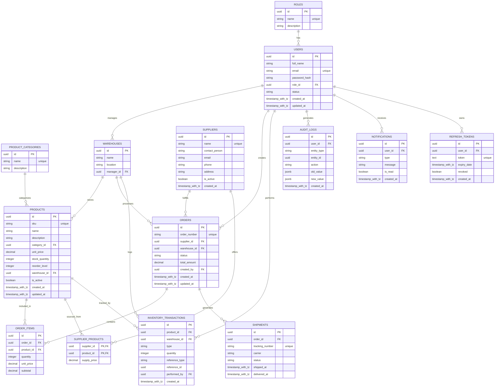

# 🗄️ Database Schema Specification

**Project Name:** Nexus Supply Chain

**Database Engine:** PostgreSQL 15 (Alpine Container Context)

**Design Paradigm:** Third Normal Form (3NF) Relational Architecture

---

## 1. Entity Relationship Diagram (ERD) Conceptual Model

The relational boundaries enforce cascade protections and tight data integrity. Foreign keys guarantee that an operational transaction or audit record cannot point to a non-existent product, order, or user account.



---


## 2. Global Structural Standards

To replicate modern P&G internal IT infrastructure, the following architectural rules are applied across all definitions:

* **Primary Keys:** Every application entity utilizes a Globally Unique Identifier (**UUIDv4**) instead of auto-incrementing sequential integers to mitigate enumeration attacks and facilitate future distributed database scaling. (Exception: `audit_logs` utilizes a sequential `BIGSERIAL` for optimized append-only indexing speed).
* **Naming Conventions:** All table identities, attribute names, and relational constraints conform strictly to **snake_case** styling guidelines.
* **Temporal Tracking:** Data records maintain structured auditing stamps leveraging explicit `TIMESTAMP WITH TIME ZONE` typing definitions to manage global distributed scheduling timelines natively.

---

## 3. Data Dictionary & Table Definitions

### 3.1 Table: `users`

Tracks authenticated identities, credential footprints, and security access profiles within the enterprise application.

```sql
CREATE TYPE user_role AS ENUM ('ROLE_STAFF', 'ROLE_ADMIN');

CREATE TABLE users (
    id UUID PRIMARY KEY DEFAULT gen_random_uuid(),
    email VARCHAR(255) NOT NULL UNIQUE,
    password_hash VARCHAR(60) NOT NULL,
    role user_role NOT NULL,
    created_at TIMESTAMP WITH TIME ZONE DEFAULT CURRENT_TIMESTAMP NOT NULL,
    updated_at TIMESTAMP WITH TIME ZONE DEFAULT CURRENT_TIMESTAMP NOT NULL
);

```

#### Fields & Constraints:

* `email`: Enforces strict uniqueness. An operational index is generated natively on this field to optimize incoming login verification routines.
* `password_hash`: Scaled to 60 characters to fit standard salt-fortified **BCrypt** digest footprints.

### 3.2 Table: `products`

The core ledger managing material catalog footprints and structural balancing metrics.

```sql
CREATE TABLE products (
    id UUID PRIMARY KEY DEFAULT gen_random_uuid(),
    sku VARCHAR(50) NOT NULL UNIQUE,
    name VARCHAR(255) NOT NULL,
    stock_quantity INTEGER NOT NULL DEFAULT 0,
    reorder_level INTEGER NOT NULL DEFAULT 10,
    created_at TIMESTAMP WITH TIME ZONE DEFAULT CURRENT_TIMESTAMP NOT NULL,
    updated_at TIMESTAMP WITH TIME ZONE DEFAULT CURRENT_TIMESTAMP NOT NULL,
    CONSTRAINT check_positive_stock CHECK (stock_quantity >= 0),
    CONSTRAINT check_positive_reorder CHECK (reorder_level >= 0)
);

```

#### Data Integrity Constraints:

* `check_positive_stock`: Database-level invariant blocking any transactional execution from forcing current inventory calculations beneath absolute zero.

### 3.3 Table: `orders`

Manages the macro-level transactional headers tracking supply chain procurement acquisitions.

```sql
CREATE TYPE order_status AS ENUM ('DRAFT', 'PENDING_APPROVAL', 'APPROVED', 'SHIPPED', 'DELIVERED', 'CANCELLED');

CREATE TABLE orders (
    id UUID PRIMARY KEY DEFAULT gen_random_uuid(),
    supplier_name VARCHAR(255) NOT NULL,
    status order_status NOT NULL DEFAULT 'DRAFT',
    created_by_id UUID NOT NULL,
    created_at TIMESTAMP WITH TIME ZONE DEFAULT CURRENT_TIMESTAMP NOT NULL,
    updated_at TIMESTAMP WITH TIME ZONE DEFAULT CURRENT_TIMESTAMP NOT NULL,
    CONSTRAINT fk_orders_user FOREIGN KEY (created_by_id) REFERENCES users(id) ON DELETE RESTRICT
);

```

#### Relational Enforcements:

* `ON DELETE RESTRICT`: Restricts the deletion of an operational user account if historical purchase order documents reference their structural identification key.

### 3.4 Table: `order_items`

Bridge ledger forming a strict composite index between distinct purchase order documents and specific target products.

```sql
CREATE TABLE order_items (
    id UUID PRIMARY KEY DEFAULT gen_random_uuid(),
    order_id UUID NOT NULL,
    product_id UUID NOT NULL,
    quantity INTEGER NOT NULL,
    CONSTRAINT fk_items_order FOREIGN KEY (order_id) REFERENCES orders(id) ON DELETE CASCADE,
    CONSTRAINT fk_items_product FOREIGN KEY (product_id) REFERENCES products(id) ON DELETE RESTRICT,
    CONSTRAINT check_positive_quantity CHECK (quantity > 0)
);

```

#### Relational Enforcements:

* `ON DELETE CASCADE`: If a draft order is purged from the platform, its child order line items are automatically cleared from the persistence plane.

### 3.5 Table: `audit_logs`

The append-only operational vault documenting system changes for absolute corporate compliance.

```sql
CREATE TABLE audit_logs (
    id BIGSERIAL PRIMARY KEY,
    entity_name VARCHAR(100) NOT NULL,
    entity_id UUID NOT NULL,
    action VARCHAR(50) NOT NULL,
    old_value TEXT,
    new_value TEXT,
    actor_id UUID,
    timestamp TIMESTAMP WITH TIME ZONE DEFAULT CURRENT_TIMESTAMP NOT NULL,
    CONSTRAINT fk_audit_user FOREIGN KEY (actor_id) REFERENCES users(id) ON DELETE SET NULL
);

```

#### Structural Strategy:

* `old_value` / `new_value`: Implemented as unstructured text allocations to capture raw historical JSON string state footprints computed during application lifecycle tracking events.
* `ON DELETE SET NULL`: If an operator account is deleted, the corresponding audit trail persists intact with the executor signature referencing a neutral `NULL` status.

---

## 4. Operational Index Strategy

To optimize query lookup performance under high transactional volumes, explicit indices are provisioned across heavy search filtering targets:

```sql
-- Accelerates lookups for single inventory configurations and barcode lookups
CREATE INDEX idx_products_sku ON products(sku);

-- Speeds up processing queues tracking active procurement fulfillment steps
CREATE INDEX idx_orders_status ON orders(status);

-- Ensures quick historical trail grouping lookups for individual target records
CREATE INDEX idx_audit_entity ON audit_logs(entity_name, entity_id);

```