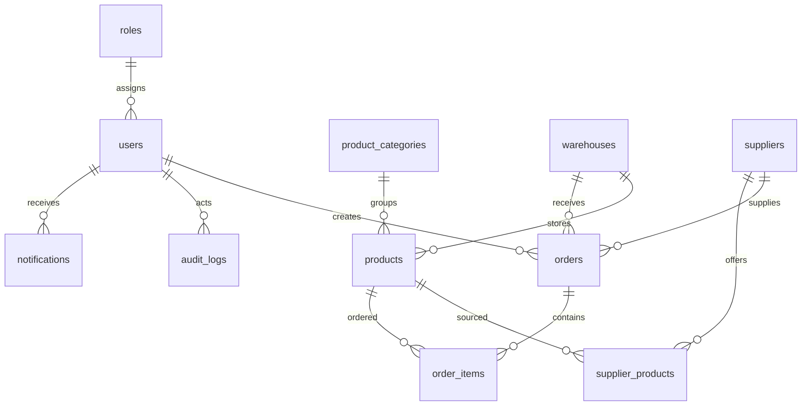

# Database schema

Liquibase applies the [changelog master](../backend/src/main/resources/db/changelog/db.changelog-master.xml) at application startup. The migration files are authoritative; the summaries below are not replacement DDL.

## Application tables

| Table | Key fields and relationships |
|---|---|
| `roles` | UUID primary key; unique name |
| `users` | UUID; full name, unique email, BCrypt hash, role FK, status, timestamps |
| `product_categories` | UUID; unique name, description |
| `warehouses` | UUID; name, location, optional manager FK to users |
| `products` | UUID; unique SKU, name/description, category and warehouse FKs, price, stock, reorder level, active flag, timestamps |
| `suppliers` | UUID; unique name, contact details, active flag, lead-time days |
| `supplier_products` | Composite supplier/product primary key; supply price |
| `orders` | UUID; unique order number, supplier/warehouse FKs, status, total, optional creator FK, timestamps and delivery dates |
| `order_items` | UUID; order/product FKs, positive quantity, unit price, subtotal |
| `audit_logs` | UUID; optional user FK, entity type/UUID, action, JSONB before/after values, creation time |
| `notifications` | UUID; user FK, type, message, read flag, creation time |

The baseline also creates `inventory_transactions`, `shipments`, and `refresh_tokens`. These tables do not imply implemented API workflows: there are no corresponding shipment, refresh-token, or stock-transfer endpoints.

```mermaid
erDiagram
    roles ||--o{ users : assigns
    users ||--o{ orders : creates
    users ||--o{ audit_logs : acts
    users ||--o{ notifications : receives
    product_categories ||--o{ products : groups
    warehouses ||--o{ products : stores
    warehouses ||--o{ orders : receives
    suppliers ||--o{ orders : supplies
    suppliers ||--o{ supplier_products : offers
    products ||--o{ supplier_products : sourced
    orders ||--o{ order_items : contains
    products ||--o{ order_items : ordered
```

## Constraints and behavior

- Primary keys are UUIDs, including `audit_logs.id`. The schema does not use a `BIGSERIAL` audit ID or PostgreSQL enum types for roles/statuses.
- Stock and reorder quantities have nonnegative checks; order-item quantities must be positive. Money columns use `DECIMAL(12,2)`.
- Order items cascade on order deletion. Product references from order items restrict product deletion. Audit user references become null if a user is deleted.
- Audit values are JSONB. The API currently serializes snapshots into strings before persistence, so clients should follow the actual response contract rather than assume an expanded object.
- Later migrations add notification, foreign-key, timestamp, status, and aggregation indexes. An index's presence does not establish a particular latency or prove that PostgreSQL will choose an index-only scan.
- No database trigger prevents direct updates/deletes to audit rows. The absence of HTTP mutation endpoints is an application permission boundary only.

`docker/scale_data.sql` is a destructive benchmark fixture script. It requires explicit opt-in, runs in a transaction, and must only target a disposable database. It is not a migration.
