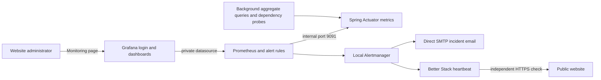

# Grafana and application monitoring

## Why Grafana fits this application

The website's Operations Dashboard answers current inventory and purchasing questions.
Grafana adds history and operational diagnosis: request rates, errors, latency, JVM
pressure, database connection saturation, dependency degradation, and inventory/order
trends. The existing Micrometer and Prometheus integration makes this a small extension
of the application architecture. Grafana is an operator tool with a separate account;
it does not replace the application's permission checks or its business dashboard.



The browser never receives the website token in a Grafana URL, embeds a dashboard,
or queries Prometheus. `/api/v1/monitoring` requires an application administrator
and returns only a validated HTTP(S) Grafana URL plus an enabled flag. An unset or
invalid URL displays the setup state. Grafana access must be granted separately;
creating an application administrator does not create a Grafana user.

## Local setup

Use the credential-generation and startup commands in [README](../README.md#run-with-docker).
The root Compose stack includes version-pinned Prometheus, Grafana and Alertmanager,
a dedicated PostgreSQL database, persistent volumes, datasource provisioning, and two dashboards in the **Nexus** folder:

- **Nexus · Operations overview** (`nexus-overview`): target availability, API request
  rate, 5xx percentage, p95 latency, routes, JVM heap/GC, process CPU,
  Hikari connections and pending borrowers, dependencies, freshness, and active alerts.
- **Nexus · Supply chain** (`nexus-supply-chain`): catalog count, active inventory units
  and value, active low-stock products, and counts for each order status over time.

Sign into the website as an administrator, choose **Monitoring**, then **Open Grafana**.
For local Compose, this opens `http://localhost:3000`. Grafana's initial login is
`admin` with `GRAFANA_ADMIN_PASSWORD` from your private `.env`. Existing Grafana
volumes keep their existing password; changing this variable does not reset it.
Use Grafana's account-management workflow to rotate it and create individual
operator accounts with the least permissions they need.

Allow roughly 30–60 seconds for startup snapshots and scrapes. Latency and error-rate
panels need application API traffic and enough samples for their five-minute window.
Use the environment and instance selectors to inspect a particular backend.
Business gauges use `max` across selected replicas because they observe a shared database;
summing them would double-count inventory. Do not aggregate different databases under
the same environment tag.

| Setting | Default and purpose |
| --- | --- |
| `APP_MONITORING_GRAFANA_URL` | Unset outside Compose; Compose uses `http://localhost:3000`. Use a browser-reachable absolute HTTP(S) URL without embedded credentials. |
| `APP_MONITORING_ENVIRONMENT` | `local`; bounded deployment name on application metrics, such as `production` or `staging`. |
| `APP_MONITORING_SNAPSHOT_INTERVAL_MS` | `30000`; clamped to at least `5000`. Passed directly to a local JVM; add it to the backend Compose environment when overriding. Adjust stale alerts if increasing it beyond two minutes. |
| `APP_MONITORING_METRICS_ENABLED` | `true`; controls background business/dependency sampling. Disabling it leaves freshness alerts unhealthy; use only for intentional test/diagnostic configurations. |
| `GRAFANA_ROOT_URL` | `http://localhost:3000/`; canonical externally visible Grafana URL. |
| `GRAFANA_COOKIE_SECURE` | `false` for localhost HTTP; set `true` behind production HTTPS. |
| `MANAGEMENT_SERVER_ADDRESS`, `MANAGEMENT_SERVER_PORT` | Loopback and `9091` by default; Compose binds internally to `0.0.0.0`, without publishing port 9091. |

Provisioning is version controlled in `docker/grafana`. Edit dashboard JSON in source
and review it; provisioned dashboards cannot be saved over from the UI. The stable
datasource UID is `nexus-prometheus`. Dashboards poll provisioning files periodically.
Grafana uses the plugins bundled in its pinned image; automatic plugin installation,
updates and UI installation are disabled. Review plugin additions as image/configuration
changes so startup does not depend on public plugin downloads.
Restart Prometheus after changing its configuration or rules:

```sh
docker compose restart prometheus
```

## Metric semantics and overhead

Micrometer exports HTTP request histograms, JVM/process, and database-pool metrics.
HTTP histogram buckets cover 5 milliseconds through 10 seconds. API recording rules
include `/api/v1/*` traffic, excluding management scrapes and `/api/health` so health
checks cannot dilute an API error rate. Route templates avoid one series per resource ID.

Custom gauges contain no customer, supplier, product, order, email, SKU, or token labels:

| Metric | Meaning |
| --- | --- |
| `nexus_inventory_products` | Catalog products, including inactive products |
| `nexus_inventory_low_stock_products` | Active products below their reorder level |
| `nexus_inventory_units` | Stock units of active products |
| `nexus_inventory_value` | Active stock × unit price, in the application's currency |
| `nexus_orders{status}` | Current order count for each of the six fixed lifecycle states |
| `nexus_dependency_up{dependency}` | Cache healthy = 1; Kafka healthy = 1. Down, unknown, or fallback = 0. |
| `nexus_events_required` | Whether this deployment requires Kafka |
| `nexus_observability_refresh_success{component}` | Most recent background refresh succeeded = 1 |
| `nexus_observability_last_success_timestamp_seconds{component}` | Last successful refresh time; 0 before first success |
| `nexus_observability_refresh_failures_total{component}` | Refresh failures since process startup |
| `nexus_observability_refresh_duration_seconds_*{component}` | Background refresh duration |

Two dedicated background tasks refresh business aggregates and dependency probes.
Scraping only reads in-memory values. Business queries use a read-only transaction
with a ten-second transaction timeout; waiting for a DB connection also depends on
Hikari's acquisition timeout. Scrapes and API handlers do not wait for these queries.
Snapshots are approximate operational views, not transactionally consistent financial
reports. Failed business refreshes retain their previous values; initial values are
unknown (`NaN`), not zero. Check freshness alongside every business chart.

Prometheus retains at most 15 days or 2 GB of sample storage, whichever limits it first;
the volume needs extra space for its write-ahead log and temporary compaction data.
Size the retention and disk to the real workload. Metrics reset on process restart;
Prometheus `rate` handles counter resets. No host-level CPU/disk claim is made:
the former unconfigured node exporter was removed because it measured its container.
Host monitoring requires an appropriately isolated host agent. Logs, traces, Kafka lag,
dead-letter backlog, and frontend real-user monitoring are separate future integrations.
The benchmark runner's node-exporter CPU/memory rows consequently report `N/A` unless
you supply a monitoring source with a properly configured host exporter; JVM and pool
measurements remain available from this stack.

## Alerts and delivery

Prometheus evaluates the source-controlled rules every 15 seconds. Grafana shows their
state through the Prometheus datasource and the overview's active-alerts panel.
These are Prometheus-managed alerts, so edit the YAML and validate with `promtool`.

| Alert | Condition held for |
| --- | --- |
| `NexusBackendDown` | Failed backend scrape for 2 minutes |
| `NexusHighErrorRate` | API 5xx ratio over 5% for 5 minutes, with at least 0.1 requests/s |
| `NexusHighLatency` | API p95 over 1 second for 10 minutes, with at least 0.1 requests/s |
| `NexusDatabasePoolSaturated` | Over 90% of connections active with waiting borrowers for 5 minutes |
| `NexusDependencyDegraded` | Cache or events unhealthy/fallback for 2 minutes |
| `NexusSnapshotFailed` | Refresh failure for 2 minutes |
| `NexusSnapshotStale` | Last successful snapshot over 120 seconds old for 2 minutes |
| `NexusTelemetryMissing` | Successful scrape without business instrumentation for 5 minutes |
| `NexusWatchdog` | Always active; sends an external heartbeat every minute, never an operator incident |
| `NexusAlertmanagerDown` | Failed Alertmanager scrape for 2 minutes |
| `NexusNotificationFailures` | Notification failures in the last five minutes, held for 2 minutes |
| `NexusRuleEvaluationFailures` | Rule evaluation failures in the last five minutes, held for 2 minutes |

Thresholds are starting values, not contractual SLOs. Tune against measured production
traffic. A quiet application should not page on one slow or failed request. A failed
scrape means lost visibility and may be caused by a collector/network problem rather
than a public-site outage. Use an independent external uptime check for that distinction.

### Better Stack email and independent uptime checks

The recommended free-account setup uses **direct SMTP email for application alerts**
and **Better Stack for heartbeat and external website checks**. Better Stack's native
Prometheus integration is a paid feature: a Free account redirects its Add action to
billing. Do not upgrade merely to follow the setup below. SMTP access depends on your
existing mail provider; this repository does not purchase an email service.

Alertmanager's heartbeat lets Better Stack detect silence from the entire local
monitoring chain. An independent HTTPS check detects a website/host outage even when
Prometheus cannot send alerts. The base development stack intentionally drops
notifications; the production overlay requires a private `ALERTMANAGER_CONFIG_DIR`.

### Free-account setup (recommended)

1. Create a Better Stack heartbeat named `Nexus monitoring`, expected every **60 seconds**
   with **180 seconds of grace**, with email enabled. On the Free plan, notifications
   go to the team rather than a configurable on-call rotation; check team membership.
2. Obtain your mail provider's **SMTP STARTTLS server on port 587**, sender address,
   username and application password. Use a dedicated sending account where available.
   Keep the password private; never use it in Git or chat.
3. Run `python3 bin/configure-alerting.py --email`. Enter SMTP details at the prompts.
   The password and heartbeat URL prompts are hidden. If the heartbeat was saved to
   `.secrets/betterstack-watchdog-url`, the helper reuses it without printing it.
   Add the printed `ALERTMANAGER_CONFIG_DIR` line to your private `.env`.
4. Once the website is deployed, add an independent HTTPS check for its `/api/health`
   endpoint and enable email notifications. Start the production stack and verify
   real heartbeat receipt and end-to-end email delivery during rollout.

The helper generates `alertmanager.email.example.yml` with mandatory STARTTLS and
certificate verification, a separately mounted SMTP password file, and firing/resolved
emails. The watchdog route still uses Better Stack. Setup makes no outbound requests.
Automated checks validate the generated configuration; actual SMTP authentication and
mail delivery require your own sender credentials and an operational deployment.

If the website/host is currently offline, **leave the heartbeat Pending**. Better Stack
starts checking deadlines only after the first heartbeat. Do not send a one-off heartbeat
or start the production collector until it can keep running, otherwise a false incident
will follow. No external website monitor can be configured without a live public URL.

### Paid native Prometheus integration (optional)

If you already have a plan that includes the integration, application incidents can
instead be managed inside Better Stack. Otherwise use direct email above.

One-time activation in your own Better Stack account:

1. Verify the operator's email and enable email incident notifications. Select the plan
   appropriate for your organization; no subscription is purchased by this repository.
2. Add a **Prometheus integration** and copy its webhook URL. This receives application
   incidents and their resolutions; do not use a raw Slack or generic incoming webhook.
3. Create a **heartbeat monitor**, expected every **60 seconds**, with **180 seconds of
   grace**, notifying that email when late. Copy the heartbeat URL, without `/fail`.
4. Run `python3 bin/configure-alerting.py` locally. Paste both URLs at its hidden prompts.
   Add the printed `ALERTMANAGER_CONFIG_DIR` setting to your private `.env`. The helper
   makes no network requests, never prints tokens, refuses overwriting existing config,
   and stores URLs under ignored `.secrets/` with a private parent directory.
5. Create an independent **HTTPS monitor** for `https://APP_DOMAIN/api/health`, requiring
   HTTP 200, at a **60-second interval** where the selected plan supports it. Enable
   email notifications and certificate-expiration monitoring in the provider UI.
6. Start the production stack, confirm heartbeat receipt and successful HTTPS checks
   in Better Stack, and use its test-notification workflow to verify email delivery.
   During a planned maintenance window, stop/restart Alertmanager and confirm the
   missed-heartbeat incident and recovery. Do not assume a saved URL proves delivery.

Both production templates group related alerts, suppress secondary snapshot/dependency
alerts while the backend is unreachable, send resolved incidents, and repeat continuing
operator incidents every four hours. The watchdog follows its own one-minute route with
`send_resolved: false`: an HTTP request on resolution must not falsely signal health.
Notification URLs are read from files and HTTP redirects are disabled. The parent
`.secrets` is mode 0700; mounted child files are readable by Alertmanager's unprivileged
container user. Protect host access and Docker administration as privileged access.

Alertmanager may keep sending a previously active watchdog until the Prometheus alert's
expiry, so a Prometheus-only failure can take several extra minutes to become a missed
heartbeat. A total host failure stops heartbeats immediately. The independent HTTPS
check supplies separate website coverage. Heartbeat/uptime notifications depend on
Better Stack; direct incident emails depend on the configured SMTP provider. This is a
practical small-team baseline, not a guaranteed paging SLA.
No external account, monitor, recipient, or live delivery is created by local verification.

## Production and Azure

The [self-hosted overlay](../docker/selfhosted.compose.yml) runs the application,
Prometheus, Grafana and Caddy on the same Docker host. It publishes only HTTP/HTTPS
through Caddy; application, database, broker, metrics and alerting services have no
host port bindings. Caddy obtains and renews TLS certificates for two separate DNS names.
Its public application route also rejects `/actuator` requests. Grafana keeps its
own login, disabled anonymous access and embedding, and secure cookies. Caddy starts
independently so a monitoring failure cannot prevent the website's proxy from starting.

1. Install Docker with **Compose 2.24.4 or newer** (`!reset` support). Point two distinct
   public DNS names at the host, allow inbound TCP 80/443 (and optionally UDP 443 for
   HTTP/3), and ensure no other server occupies those ports. Certificate issuance
   requires real reachable DNS and outbound access to the certificate authority.
2. Generate private credentials using the README instructions. Keep demo data disabled.
   Add these deployment settings to the private `.env`, replacing the example names:

   ```dotenv
   APP_DOMAIN=nexus.example.com
   GRAFANA_DOMAIN=metrics.example.com
   CADDY_ACME_EMAIL=operations@example.com
   APP_MONITORING_ENVIRONMENT=production
   ```

   The email is optional. Domain values must be bare, distinct DNS names without a
   scheme or path. The overlay derives the HTTPS Grafana link, canonical URL, secure
   cookies, and application CORS origin from them; no frontend rebuild is needed when
   changing only the Grafana destination.
3. Complete the Better Stack setup above and set `ALERTMANAGER_CONFIG_DIR`. From the
   repository root, validate and start the chosen deployment:

   ```sh
   docker compose -f docker-compose.yml -f docker/selfhosted.compose.yml config --quiet
   docker compose -f docker-compose.yml -f docker/selfhosted.compose.yml up -d --build
   docker compose -f docker-compose.yml -f docker/selfhosted.compose.yml logs caddy
   ```

4. Verify `https://APP_DOMAIN/api/health`, website login, administrator **Monitoring**,
   the separate Grafana login, current snapshots and healthy Prometheus targets through
   Grafana. HTTP should redirect to HTTPS. Check certificate renewal after startup.
   Remove application bootstrap credentials after provisioning users.

Use **both Compose files for every lifecycle command** in this deployment mode. Use
`down` without `-v` to preserve application data, monitoring history, Grafana accounts
and Caddy's certificate/configuration volumes. Do not switch to the base-only startup
command on the same host: that reintroduces development port bindings and can conflict
with the proxy. Back up `caddy_data` securely; it contains TLS private keys.

The application deliberately does not trust forwarded client addresses. Its login
limit therefore applies collectively to clients behind Caddy; size it for expected
traffic and use trusted gateway rate limiting before expanding that policy. This
overlay is a single-host deployment, not high availability. DNS, certificate issuance,
host capacity, backups, and receiver delivery need verification on the chosen host.
For private-only installations, a VPN/SSH tunnel to the base stack is also supported.

### Network isolation and capacity

Separate internal Docker bridges isolate application data, Grafana data, management
metrics, and the two ingress paths. Caddy joins ingress networks and its own Internet
network; it cannot directly reach either database. Grafana cannot reach the application
PostgreSQL/Redis/Kafka network, and the backend cannot reach Grafana's database network.
Only Alertmanager joins the notification egress network. The development-only bridge
used for localhost-published ports is removed from all services by the production overlay. Grafana and the backend have
no general Internet route in the production overlay; external integrations require a
reviewed egress change. The metrics network remains trusted: its members can reach the
backend management listener. This is segmentation, not per-port firewall enforcement.

| Service | CPU ceiling | Memory ceiling | PID ceiling |
| --- | ---: | ---: | ---: |
| Prometheus | 1 | 1024 MiB | 128 |
| Grafana | 1 | 768 MiB | 256 |
| Grafana PostgreSQL | 0.5 | 512 MiB | 128 |
| Alertmanager | 0.25 | 128 MiB | 128 |
| Caddy | 0.5 | 128 MiB | 128 |

These limits protect the shared application host from unbounded monitoring consumption;
they are starting budgets, not a production capacity certification. Reserve additional
memory/CPU/disk for the application, Kafka, Redis, application PostgreSQL, and the OS.
Tune `*_CPUS` and `*_MEMORY_LIMIT` Compose variables from measured usage. Swap is capped
at the same memory limit. Prometheus limits concurrent queries to ten and samples per
query to five million. Grafana's DB pool is capped at ten connections. Watch OOM events
and rule evaluation failures when adjusting budgets.

### Grafana storage, migration and backup

Grafana uses a **dedicated PostgreSQL instance**, not the application's database or
SQLite. Its `grafana` login owns only the Grafana database and has no superuser,
create-role, create-database or replication privileges. Bootstrap uses a separate
`GRAFANA_DB_ADMIN_PASSWORD`; Grafana receives only `GRAFANA_DB_PASSWORD`. The unencrypted
DB connection stays on the same host's internal Grafana database bridge. A remote or
multi-host database needs TLS with certificate verification instead.

Keep `GRAFANA_SECRET_KEY` stable and back it up separately in your password manager:
it protects encrypted datasource secrets. Changing environment passwords does not
rotate passwords in an already initialized database. Rotate both DB credentials using
PostgreSQL's account-management workflow and update the private configuration together.

For an **existing SQLite volume**, startup refuses to continue until migration is
acknowledged, avoiding a silent switch to empty accounts and settings. Back up the old
volume first. Test migration against a copy, or explicitly choose a fresh PostgreSQL
installation, reprovision dashboards, recreate users/teams/permissions and verify data
sources. Set `GRAFANA_SQLITE_MIGRATION_ACKNOWLEDGED=true` only after completing that
review. There is no automatic cross-database migration here. Do not delete the old
SQLite backup until the new installation is accepted.

Create a consistent, private logical backup (directory must already exist):

```sh
mkdir -m 700 -p .backups
./bin/backup-grafana.sh .backups/grafana-$(date +%Y%m%d-%H%M%S).dump
```

The helper uses a read-only `docker compose exec` against the running base project;
it does not recreate containers or change production port mappings. It writes mode 0600,
refuses overwrites, and removes partial files after failures. If you use a custom Compose
project name, set the same `COMPOSE_PROJECT_NAME`. Copy backups to encrypted off-host
storage and retain the matching secret key. Schedule backups according to your recovery
requirements; this change does not install a host scheduler.

Restore into a **new disposable PostgreSQL database first**, using `createdb` followed
by `pg_restore --exit-on-error --no-owner -d RESTORE_DATABASE BACKUP.dump` as its database
owner. Start the matching Grafana version against that restored database with the same
secret key and verify accounts, permissions, dashboards and datasource health. For a
production restore, stop Grafana writes, retain a pre-restore backup, restore into a
fresh database owned by `grafana`, and switch only after validation. The monitoring
verification round-trips a real dump and restarts Grafana on the restored database and checks a restored user login, both
dashboards, and datasource health.

Back up Prometheus history and `grafana_data` (plugins/files) separately as required;
users, permissions and runtime metadata now live in `grafana_db_data`. Git remains the
source of dashboard JSON and provisioning. Test version upgrades against copies before
upgrading existing Prometheus 2/Grafana 11 installations. Never open a newer Grafana DB
with an older binary as an untested rollback. Business aggregates are confidential data.

**The existing Terraform Azure App Service deployment is a single application container;
it does not run this Compose stack or expose its private management port to a remote
Prometheus server.** Terraform now accepts independent `monitoring_grafana_url` and
`staging_monitoring_grafana_url` values and stamps environment tags; both are slot-sticky.
These settings enable the website link only. Production collection still requires a
collector on a supported private-network/sidecar deployment, or a move to a host that
can run the application and monitoring stack together. Grafana Cloud/Managed Grafana
can use the dashboard JSON after configuring its datasource UID and private ingestion.
Do not expose `/actuator/prometheus` through the public website to work around this.
No cloud resources or receiver credentials are provisioned by this change.

## Verification and troubleshooting

```sh
./bin/verify.sh monitoring
```

Requires Docker Compose 2.24.4+, Python 3, and network access for pinned images/build
dependencies. The command validates the self-hosted Compose merge and Caddy configuration
without publishing ports or requesting certificates, validates Prometheus, and executes alert-rule
fixtures, then builds the combined app in a uniquely named Compose project with fresh
PostgreSQL/Redis/Kafka, random credentials, and random loopback ports. It checks real
scraping, metric series, administrator/staff boundaries, Grafana datasource connectivity,
dashboard provisioning, healthy rule evaluation, resource limits, restricted DB role,
backup restoration, and real firing/resolved notifications through Alertmanager to a
disposable local receiver. It also checks watchdog routing.
It removes only that project's containers, volumes and built application image on exit.
The normal `.env`, ports, named containers and persistent application volumes are unused.
Verification replaces all receiver configuration with local test URLs on an internal
Docker network and bypasses HTTP proxies for local requests. No external notification
route exists, so disposable credentials and alerts stay in the test stack.
The same check gates staging deployment in CI.

For only Caddy/Compose/Prometheus/Alertmanager configuration and rule fixtures, use
`./bin/verify-monitoring.sh --config-only`. This does not start the application stack.

For missing data, inspect Prometheus **Status → Targets**, backend logs and
`nexus_observability_refresh_success`; confirm the selected environment/instance and
generate normal API traffic. For failed Grafana provisioning, inspect
`docker compose logs grafana` and verify the datasource UID and mounts. For slow
snapshots, inspect refresh duration and database query plans. For degraded events/cache,
check `/api/health`, dependency connectivity and Kafka-required configuration. Never
interpret empty or stale panels as a healthy zero.

References: [Grafana provisioning](https://grafana.com/docs/grafana/latest/administration/provisioning/),
[Grafana Docker configuration](https://grafana.com/docs/grafana/latest/setup-grafana/configure-docker/),
[Prometheus alerting rules](https://prometheus.io/docs/prometheus/latest/configuration/alerting_rules/),
[histogram quantiles](https://prometheus.io/docs/prometheus/latest/querying/functions/#histogram_quantile),
[Better Stack Prometheus integration](https://betterstack.com/docs/uptime/prometheus/),
[Better Stack heartbeat monitoring](https://betterstack.com/docs/uptime/cron-and-heartbeat-monitor/),
[Caddy automatic HTTPS](https://caddyserver.com/docs/automatic-https), and
[Compose override rules](https://docs.docker.com/reference/compose-file/merge/).
