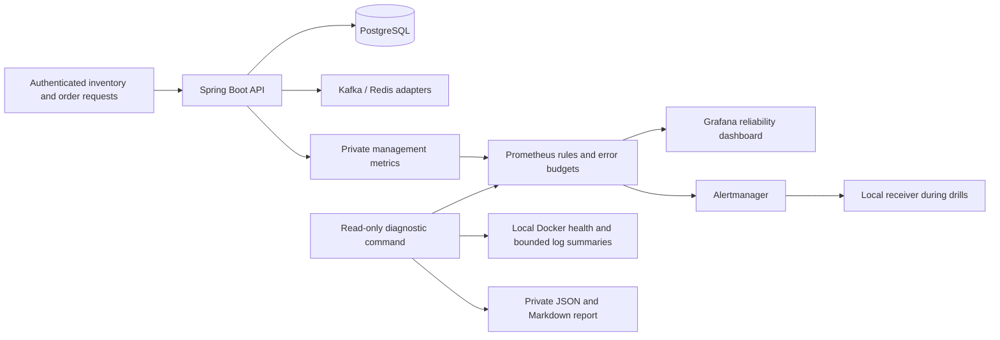

# Reliability engineering case study

## Problem and scope

Warehouse users need reliable stock lookup and purchase-order creation. Resource
charts alone cannot show whether those operations meet a useful service target,
and collecting the same evidence repeatedly slows incident investigation.

This project adds three independent capabilities: request-based service objectives,
a disposable incident exercise, and a read-only diagnostic report. Each has its
own feature branch, tests and operational rationale. Measurements below are local
experiments on synthetic application data, not production uptime or customer-impact
claims. A single-host Docker installation is not a highly available service.

## Decisions and tradeoffs

| Decision | Reason | Limitation |
| --- | --- | --- |
| Measure inventory reads and order creation | These operations support stock decisions and replenishment | Other routes and business correctness require separate checks |
| Count eligible good/total responses | Counts aggregate correctly across replicas and express user-visible outcomes | Server metrics miss DNS, TLS and requests that never arrive |
| Use 99.9% success and 99% inventory success within 500 ms as proposals | Establish an explicit hypothesis to validate against workload and user needs | No customer agreement or observed monthly attainment is implied |
| Alert on both long and short budget-burn windows | Sustained impact is actionable; an old spike should stop alerting after recovery | Low traffic needs independent probes and explicit volume tradeoffs |
| Require complete history before monthly claims | Missing telemetry must not turn into apparent success | New deployments remain incomplete for at least a month |
| Run fault injection only in generated local projects | Exercise real dependencies without changing an existing application database | This tests a lab failure mode, not regional or multi-host resilience |
| Export structural diagnostic summaries | Operators can share bounded evidence without copying free-text credentials or customer data | Detailed root-cause investigation can still require restricted logs |
| Compare equivalent collection commands | A reproducible comparison can quantify repeated collection overhead | Machine elapsed time does not measure human investigation savings |

The approach follows [Google's SLO guidance](https://sre.google/workbook/implementing-slos/),
[burn-rate alerting](https://sre.google/workbook/alerting-on-slos/),
[incident learning](https://sre.google/workbook/postmortem-culture/), and
[measuring toil](https://sre.google/workbook/eliminating-toil/). The concrete thresholds
and scope are project decisions, not universal industry requirements.

## Architecture and operating loop

The operator confirms the affected operation, checks evidence freshness, selects a
runbook, performs the approved recovery step, verifies the operation, and records a
preventive action. Automation assists observation; it does not infer a root cause or
silently restart production services.

## Measured request baseline

One 60-second run on 26 September 2026, **01:37:07–01:38:07 UTC**, used a disposable
PostgreSQL/Redis/Kafka application stack with ten seeded products. Five warm-up
operations per journey were excluded. Arrivals were scheduled at ten inventory
reads and one order creation per second, with at most sixteen requests in flight.
Orders each contained one active product and quantity one.

| Operation | Completed / scheduled | HTTP outcomes | Client p95 | Client p99 | Maximum |
| --- | ---: | --- | ---: | ---: | ---: |
| Inventory read | 600 / 600 | 600 HTTP 200 | 11.86 ms | 20.41 ms | 29.52 ms |
| Order creation | 60 / 60 | 60 HTTP 201 | 24.28 ms | 34.16 ms | 34.16 ms |

There were no dropped arrivals, transport failures or contract failures. Every
inventory response in this sample succeeded within 500 ms. These are client timings,
including connection and body-transfer time; the dashboard's latency objective uses
a separate exact server-side histogram bucket. The small dataset, warm cache and short
run do not establish capacity, a production latency distribution or a 30-day SLO.

Docker server 29.5.3 on aarch64 had ten CPUs and 8,321,515,520 bytes of VM memory.
The existing development stack remained running; this is a development-host measurement,
not a controlled hardware benchmark. No independent external uptime was measured.
The baseline runner source SHA-256 was
`8069c3850b8f39a2f7a83b480cf55966cfef96546740ed696051a0dbb4590064`.
The private JSON report SHA-256 was
`13254f76bb206848514e6e4238900ed7eb17b64fabd47ad40a85edefedc803b7`;
the generated report stays outside Git at `load-tests/results/slo-baseline-20260926.json`.

## Measured diagnostic collection

Three paired machine trials on the running local stack compared five separate
section commands with one combined command. Both collected identical sections,
queries and bounded projections. Median elapsed times were **1.198 seconds** and
**0.313 seconds**, respectively. Ordering alternated; the experiment primarily
measures repeated process/discovery overhead. It does not establish saved human
minutes or faster incident resolution.

A separate observation during an actual disposable backend stop preserved the stopped
container, failed scrape, pending alert and missing metrics in a partial report.
It did not label missing metrics as healthy. See the [reviewed diagnostic measurements](diagnostic-measurements.md)
for individual trials, provenance, missing evidence and the human-study protocol.

## Measured incident drills

A completed run on 26 September 2026, **01:47:37–02:04:29 UTC**, stopped the backend
and then stopped PostgreSQL while leaving the backend running. Each scenario
started with verified inventory access, a fresh business snapshot and a working
local notification receiver. Production scrape, rule-hold and Alertmanager grouping
intervals were unchanged.

| Interval | Backend stopped | PostgreSQL stopped |
| --- | ---: | ---: |
| Fault active to observed failure signal | 12.055 s | 48.261 s |
| Fault active to observed firing delivery | 172.574 s | 208.918 s |
| Recovery action to verified login and inventory access | 11.019 s | 4.423 s |
| Fault active to verified user recovery | 183.593 s | 213.348 s |
| User recovery to observed resolved delivery | 289.035 s | 295.512 s |

Both scenarios passed fresh post-recovery telemetry checks and received firing and
resolved notifications for the same alert episode. During the database outage, the
backend process and its scrape stayed up while the authenticated operation failed.
This demonstrates why process reachability alone is insufficient evidence of service
health. Cleanup verified removal of every project-owned container, network and volume.

The five-minute Alertmanager grouping interval explains much of the resolved-delivery
delay; it is distinct from user recovery. Recovery was automated after firing delivery,
so these individual observations do not measure human acknowledgement, diagnosis time,
production MTTD/MTTR, write correctness or backup restoration. Polling and local resource
contention also affect the measured intervals.

Development of the drill exposed a recovery-harness defect: Docker can change an
assigned loopback port when a container restarts. The corrected runner rediscovers and
validates the new endpoint, and both a regression test and the final backend exercise
verified recovery through it. The [reviewed postmortem](incidents/2026-09-26-local-drills.md)
records the timeline, causal analysis, completed corrections and remaining follow-ups.
The [runbooks](incident-response.md) define incident roles, impact-based severity,
stakeholder updates and verification steps; human coordination was not measured.

The measured source commit was `20982bca237d0ceadb246e076e8d1e99014c54cb`.
Private report SHA-256:
`aabcea03021879cb1e1d067441cd62bc3af26a40da756880cd5c4a26ca435e9c`.
Raw reports stay outside Git under `.artifacts/incidents/`.

## Reproduce and demonstrate

After the three feature PRs are merged, use Java 17, Node 24, Python 3 and Docker.
Run the required repository checks before a demonstration. The commands below belong
to the corresponding feature branches until they are merged.

1. Read the [service objectives](service-objectives.md) and show **Nexus · Service objectives**. Explain
   the good-event definitions, volume gates, partial data and error-budget policy.
2. Run `./bin/verify-monitoring.sh --baseline-report load-tests/results/demo-baseline.json`
   with a new output filename. It creates and cleans up its own stack. Explain why
   a short successful sample cannot prove a monthly target.
3. Follow the [incident runbooks](incident-response.md) to run a real disposable failure and show its
   timeline, notification evidence, recovery verification and cleanup outcome.
   Allow the documented production alert/notification waits to elapse.
4. Follow the [diagnostic guide](diagnostics.md) and run
   `python3 bin/diagnose.py --project nexus-local` against an already-running
   local stack, or the supported generated drill project during an exercise.
   Explain the difference between complete evidence collection and service health.
5. Show the postmortem's causal chain and verified follow-up action. Identify what
   the evidence proves, what remains uncertain, and the next measurement needed.

The normal local app is not the fault-injection target. Reports are private and
contain only the documented bounded fields. The user must supply a continuously
running host and public URL before external production uptime can be demonstrated.

## Future work with a specific purpose

Application PostgreSQL restore drills would establish recovery-time/data-loss evidence
for inventory and orders; the current monitoring check restores Grafana's database.
Correlated logs and traces would help locate cross-component latency once the current
metrics cannot explain an observed delay. Multi-host resilience should follow an actual
availability requirement. Kubernetes, a paid monitoring tier, and another alert service
are not prerequisites for the current local objectives.
